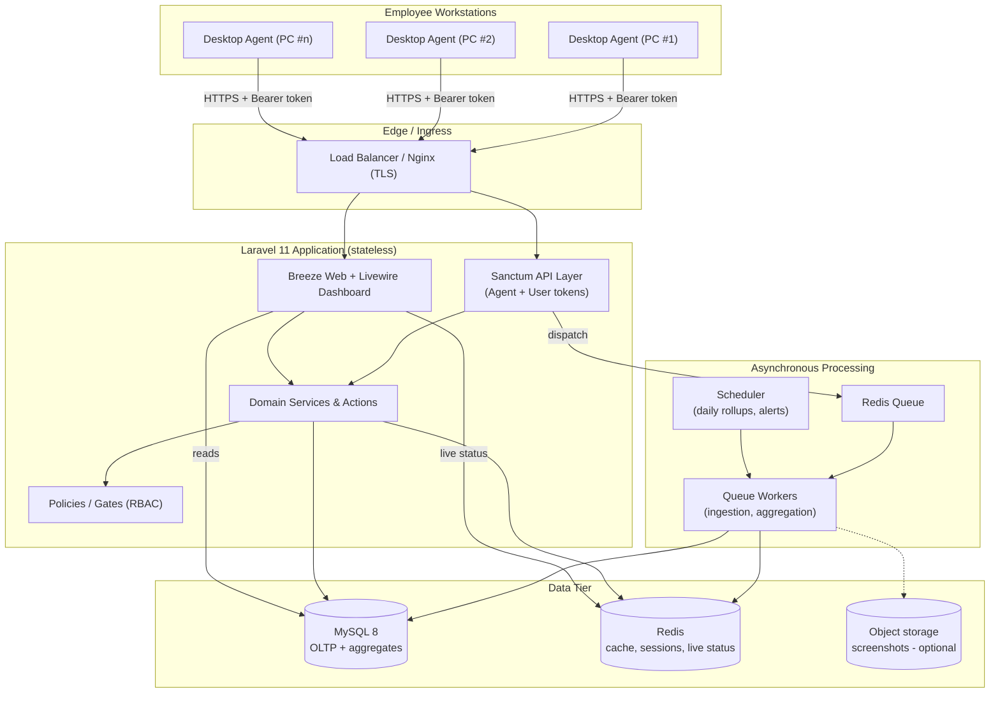
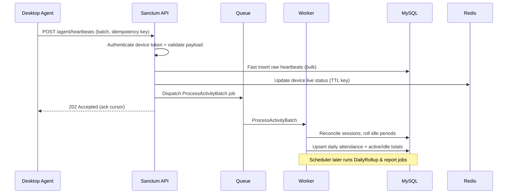

# 1. System Architecture

## 1.1 Goals & non-goals

**Goals**

- Reliably ingest high-frequency workstation activity from many PCs with minimal
  server overhead.
- Derive attendance, active/idle time, and productivity metrics from raw events.
- Provide a fast, role-aware dashboard with near-real-time device status.
- Be horizontally scalable (stateless API + queue workers) and privacy-aware.

**Non-goals (for the Laravel backend)**

- Building the native desktop agent (Windows/macOS/Linux client). The backend
  only defines and consumes its API contract.
- Keystroke logging or invasive surveillance. The system records *aggregate*
  activity signals, not content, by default (screenshots are opt-in and gated).

## 1.2 Component overview

The platform is composed of five logical tiers.



### Tier responsibilities

| Tier | Responsibility |
| ---- | -------------- |
| **Desktop Agent** | Detects PC login/logout, samples input activity to classify active vs idle, reports current status and foreground app usage, buffers offline and batches uploads. Authenticated per device. |
| **Ingress** | TLS termination, HTTP routing, rate limiting at the edge, static asset serving. |
| **API Layer** | Validates and authenticates requests (Sanctum), accepts agent telemetry, exposes user-facing REST resources. Keeps request handling thin — heavy work is queued. |
| **Domain Services / Actions** | Business logic: session reconciliation, active/idle computation, attendance derivation, productivity scoring, report generation. |
| **Async Processing** | Queue workers process telemetry batches out of the request cycle; the scheduler runs periodic rollups (daily attendance close-out, weekly reports) and alert evaluation. |
| **Data Tier** | MySQL for transactional and aggregated data; Redis for cache, sessions, rate limiting, and live device status; optional object storage for screenshots. |

## 1.3 Ingestion & processing flow

The core design decision is to keep the write path **thin and idempotent** and
push computation to workers.



**Why this shape**

- **Bulk insert first, compute later** keeps p95 latency low even under bursty
  uploads from hundreds of agents at shift start/end.
- **Idempotency keys** on batches let agents retry safely after network loss
  without double-counting.
- **Redis live status** with a short TTL gives the dashboard an accurate
  online/idle/offline view without polling the OLTP tables.
- **Scheduler-driven rollups** produce stable, queryable daily/weekly aggregates
  so dashboards never scan raw heartbeat tables.

## 1.4 Live device status model

Each heartbeat refreshes a Redis key `device:{id}:status` with a TTL slightly
longer than the heartbeat interval. Status is derived as:

| Condition | Status |
| --------- | ------ |
| Key present, last sample `active` | **online / active** |
| Key present, last sample `idle`   | **idle** |
| Key present, OS reported lock      | **locked** |
| Key expired (no heartbeat within TTL) | **offline** |

A scheduled job sweeps expired keys and writes a definitive `offline` transition
to `work_sessions` so history is complete even when an agent dies without
sending a logout.

## 1.5 Authentication model (two token audiences)

Laravel Sanctum issues two distinct kinds of tokens with disjoint abilities:

- **Agent (device) tokens** — minted once during device registration/pairing,
  long-lived, scoped to `agent:*` abilities (`agent:report`). Cannot touch
  user-facing resources.
- **User tokens** — issued to dashboard/mobile users, scoped to abilities
  derived from their role. Session-based Breeze auth is used for the web
  dashboard itself; Sanctum user tokens serve API/SPA/mobile clients.

See [API Structure](05-api-structure.md) for the ability matrix.

## 1.6 Authorization (RBAC)

Roles are enforced with **Spatie Laravel-Permission** and Laravel Policies.

| Role | Scope |
| ---- | ----- |
| **Super Admin** | Full access, organization settings, user & role management |
| **Admin / HR** | All employees, attendance corrections, reports, device management |
| **Manager / Team Lead** | Only members of their team(s); read reports, approve corrections |
| **Employee** | Own attendance & productivity data only |

Every dashboard query and API resource is filtered through a policy plus a
team/department scope, so a manager can never read another team's data even by
guessing IDs.

## 1.7 Scalability & reliability

- **Stateless app servers**: sessions and cache in Redis, so app nodes scale
  horizontally behind the load balancer.
- **Queue-based back pressure**: telemetry spikes queue up rather than
  overwhelming the database; workers scale independently.
- **Table partitioning**: high-volume `activity_heartbeats` and `app_usage_logs`
  are partitioned by month (see [Database Design](03-database-design.md)) and
  pruned/archived per retention policy.
- **Read/write separation (future)**: dashboards can be pointed at a read
  replica once volume grows.

## 1.8 Security & privacy

- TLS everywhere; HSTS at the edge.
- Device tokens hashed at rest (Sanctum default), revocable per device.
- Rate limiting on both agent and user API groups.
- **Data minimization**: default telemetry is aggregate activity, not content.
  Screenshot capture is a per-organization opt-in feature, disabled by default,
  with configurable frequency and blur, and is surfaced to employees.
- **Auditability**: every administrative mutation (attendance edit, role change,
  setting change) is written to an `audit_logs` trail.
- **Retention**: configurable raw-data retention window; aggregates retained
  longer than raw heartbeats. Supports regional compliance (e.g. GDPR-style
  right-to-erasure via employee purge).

## 1.9 Deployment topology (reference)

```
┌────────────┐    ┌─────────────────────┐    ┌──────────────┐
│  Nginx /   │──▶ │  PHP-FPM app nodes   │──▶ │   MySQL 8    │ (primary + replica)
│  LB (TLS)  │    │  (Laravel 11)        │    └──────────────┘
└────────────┘    └─────────┬───────────┘    ┌──────────────┐
                            │             ──▶ │    Redis     │ (cache/queue/status)
                  ┌─────────▼───────────┐    └──────────────┘
                  │  Queue worker nodes  │    ┌──────────────┐
                  │  + Scheduler (cron)  │──▶ │ Object store │ (optional screenshots)
                  └─────────────────────┘    └──────────────┘
```

Recommended process supervision: **Supervisor** for `queue:work`, a single cron
entry for `schedule:run`, and Laravel Horizon if Redis queues are used (gives
queue metrics and failed-job visibility).
