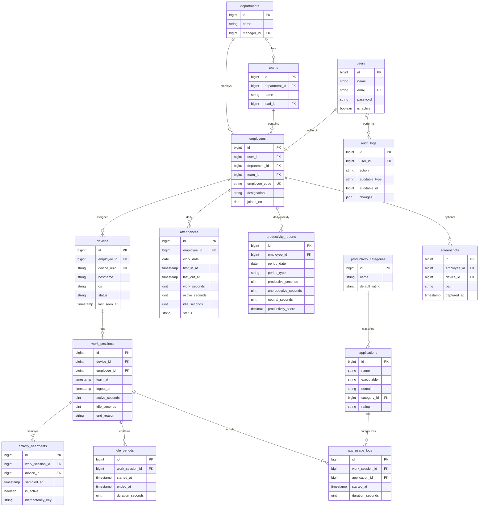

# 3. Database Design

The schema separates three concerns:

1. **Organization & identity** — who works here, in which team, on which device.
2. **Raw telemetry (high volume)** — sessions, heartbeats, idle periods, app
   usage. Written fast, partitioned, and pruned.
3. **Derived aggregates (query-friendly)** — attendance and productivity rollups
   the dashboard reads.

## 3.1 Entity relationship diagram



## 3.2 Table specifications

### Organization & identity

**`departments`**

| Column | Type | Notes |
| ------ | ---- | ----- |
| id | bigint PK | |
| name | varchar(120) | unique |
| manager_id | bigint FK → users.id | nullable |
| timestamps | | |

**`teams`**

| Column | Type | Notes |
| ------ | ---- | ----- |
| id | bigint PK | |
| department_id | bigint FK → departments.id | |
| name | varchar(120) | |
| lead_id | bigint FK → users.id | nullable (team lead / manager) |
| timestamps | | |

**`users`** (Breeze/Sanctum owner; role via Spatie `model_has_roles`)

| Column | Type | Notes |
| ------ | ---- | ----- |
| id | bigint PK | |
| name | varchar | |
| email | varchar | unique |
| password | varchar | |
| is_active | boolean | default true; disables login without deleting |
| email_verified_at, remember_token, timestamps | | Breeze defaults |

**`employees`** (HR profile, 1:1 with a user)

| Column | Type | Notes |
| ------ | ---- | ----- |
| id | bigint PK | |
| user_id | bigint FK → users.id | unique, cascade on delete |
| department_id | bigint FK → departments.id | nullable |
| team_id | bigint FK → teams.id | nullable |
| employee_code | varchar(40) | unique |
| designation | varchar(120) | nullable |
| joined_on | date | nullable |
| timestamps, soft deletes | | |

**`devices`** (a registered PC; owns the agent token via Sanctum polymorphic relation)

| Column | Type | Notes |
| ------ | ---- | ----- |
| id | bigint PK | |
| employee_id | bigint FK → employees.id | nullable until paired |
| device_uuid | varchar(64) | unique; agent-generated hardware fingerprint |
| hostname | varchar(191) | |
| os | varchar(60) | e.g. `Windows 11` |
| agent_version | varchar(20) | |
| status | enum | `online\|idle\|locked\|offline` (last known, mirror of Redis) |
| last_seen_at | timestamp | |
| paired_at | timestamp | nullable |
| timestamps, soft deletes | | |

### Raw telemetry (high volume)

**`work_sessions`** (one PC login→logout span)

| Column | Type | Notes |
| ------ | ---- | ----- |
| id | bigint PK | |
| device_id | bigint FK → devices.id | |
| employee_id | bigint FK → employees.id | denormalized for fast per-employee queries |
| login_at | timestamp | |
| logout_at | timestamp | nullable while active |
| active_seconds | int unsigned | rolled up from heartbeats |
| idle_seconds | int unsigned | |
| end_reason | enum | `logout\|shutdown\|timeout\|reconciled` |
| timestamps | | |

Indexes: `(employee_id, login_at)`, `(device_id, login_at)`.

**`activity_heartbeats`** (periodic activity samples — the highest-volume table)

| Column | Type | Notes |
| ------ | ---- | ----- |
| id | bigint PK | |
| work_session_id | bigint FK | |
| device_id | bigint FK | |
| sampled_at | timestamp | |
| is_active | boolean | active (input within idle threshold) vs idle |
| idempotency_key | char(36) | unique per device+sample; dedupes retries |
| created_at | timestamp | |

Indexes: `(work_session_id, sampled_at)`, unique `(device_id, idempotency_key)`.
**Partitioned by `RANGE (TO_DAYS(sampled_at))` monthly**; pruned per retention.

**`idle_periods`** (materialized idle spans, derived from consecutive idle heartbeats)

| Column | Type | Notes |
| ------ | ---- | ----- |
| id | bigint PK | |
| work_session_id | bigint FK | |
| started_at | timestamp | |
| ended_at | timestamp | nullable while ongoing |
| duration_seconds | int unsigned | |

**`applications`** (catalog of executables/domains, classified for productivity)

| Column | Type | Notes |
| ------ | ---- | ----- |
| id | bigint PK | |
| name | varchar(191) | e.g. `Visual Studio Code` |
| executable | varchar(191) | nullable, e.g. `Code.exe` |
| domain | varchar(191) | nullable, e.g. `youtube.com` |
| category_id | bigint FK → productivity_categories.id | nullable |
| rating | enum | `productive\|unproductive\|neutral` (override of category default) |
| timestamps | | |

**`productivity_categories`**

| Column | Type | Notes |
| ------ | ---- | ----- |
| id | bigint PK | |
| name | varchar(120) | e.g. `Development`, `Social Media` |
| default_rating | enum | `productive\|unproductive\|neutral` |

**`app_usage_logs`** (foreground app time; optional/advanced feature)

| Column | Type | Notes |
| ------ | ---- | ----- |
| id | bigint PK | |
| work_session_id | bigint FK | |
| application_id | bigint FK → applications.id | nullable if unrecognized |
| raw_title | varchar(191) | nullable; unmatched window/app label for later classification |
| started_at | timestamp | |
| duration_seconds | int unsigned | |

Indexes: `(work_session_id, started_at)`. Partitioned monthly like heartbeats.

### Derived aggregates (query-friendly)

**`attendances`** (one row per employee per day — the dashboard's attendance source)

| Column | Type | Notes |
| ------ | ---- | ----- |
| id | bigint PK | |
| employee_id | bigint FK | |
| work_date | date | |
| first_in_at | timestamp | earliest login of the day |
| last_out_at | timestamp | latest logout of the day |
| work_seconds | int unsigned | login-to-logout span, summed |
| active_seconds | int unsigned | |
| idle_seconds | int unsigned | |
| status | enum | `present\|late\|absent\|half_day\|on_leave` |
| is_corrected | boolean | true if an admin edited it |
| timestamps | | |

Unique: `(employee_id, work_date)`.

**`productivity_reports`** (per-employee rollups, daily & weekly)

| Column | Type | Notes |
| ------ | ---- | ----- |
| id | bigint PK | |
| employee_id | bigint FK | |
| period_type | enum | `daily\|weekly\|monthly` |
| period_date | date | period anchor (day or week/month start) |
| productive_seconds | int unsigned | |
| unproductive_seconds | int unsigned | |
| neutral_seconds | int unsigned | |
| active_seconds | int unsigned | |
| productivity_score | decimal(5,2) | 0–100, see §3.4 |
| timestamps | | |

Unique: `(employee_id, period_type, period_date)`.

### Cross-cutting

**`screenshots`** (opt-in only)

| Column | Type | Notes |
| ------ | ---- | ----- |
| id | bigint PK | |
| employee_id, device_id | bigint FK | |
| path | varchar(255) | object-storage key |
| captured_at | timestamp | |

**`settings`** (per-organization key/value overrides of `config/treck.php`)

| Column | Type | Notes |
| ------ | ---- | ----- |
| id | bigint PK | |
| key | varchar(120) | unique |
| value | json | |

**`audit_logs`**

| Column | Type | Notes |
| ------ | ---- | ----- |
| id | bigint PK | |
| user_id | bigint FK | actor |
| action | varchar(80) | e.g. `attendance.corrected` |
| auditable_type / auditable_id | morph | affected record |
| changes | json | before/after diff |
| ip_address | varchar(45) | |
| created_at | timestamp | |

Sanctum's `personal_access_tokens` table (tokens for both devices and users) and
Spatie's `roles` / `permissions` / `model_has_roles` tables are created by their
respective packages.

## 3.3 Aggregation strategy

Dashboards **never** scan `activity_heartbeats`. Instead:

1. **On ingest** — `ProcessActivityBatch` updates the parent `work_session`'s
   running `active_seconds` / `idle_seconds` and closes/opens `idle_periods`.
2. **Hourly** — a light job refreshes today's `attendances` row for currently
   online employees (so "today" is near-live).
3. **Nightly (scheduler)** — `RollUpDailyAttendance` finalizes yesterday's
   attendance and `GenerateProductivityReport` writes daily
   `productivity_reports`; a weekly job rolls those into weekly rows.

This keeps reads O(rows-per-day) instead of O(heartbeats).

## 3.4 Productivity score formula

```
productive_seconds  = Σ app_usage where rating = productive
unproductive_seconds= Σ app_usage where rating = unproductive
neutral_seconds     = Σ app_usage where rating = neutral

productivity_score = 100 * productive_seconds
                     / max(active_seconds, 1)        # neutral & idle excluded from numerator
```

Score is clamped to `[0, 100]`. When app-usage capture is disabled, the score
falls back to an **active-ratio** proxy: `100 * active_seconds / work_seconds`.

## 3.5 Retention & partitioning

- `activity_heartbeats` and `app_usage_logs`: monthly `RANGE` partitions; a
  scheduled `PruneRawTelemetry` command drops partitions older than
  `treck.retention.raw_heartbeat_days`.
- `attendances` and `productivity_reports` are small and kept for
  `treck.retention.aggregate_days`.
- Employee purge (right-to-erasure) cascades through `employees` soft-delete +
  a queued hard-delete of associated telemetry.

See [`database/schema.sql`](database/schema.sql) for concrete DDL.
