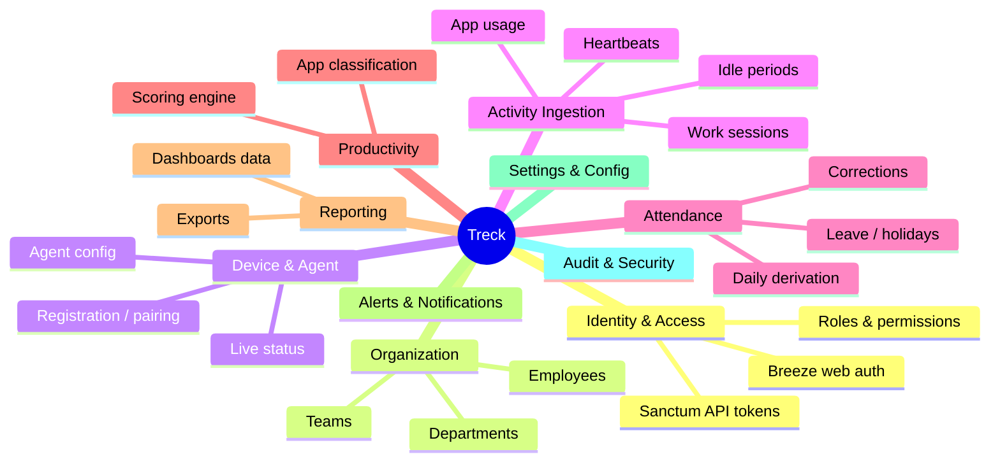

# 4. Modules List

The system is organized into functional modules. Each maps to a set of models,
services, controllers/Livewire components, and policies.

## 4.1 Module map

## 4.2 Module responsibilities

### 1. Identity & Access Management

- Laravel Breeze session auth for the dashboard; Sanctum tokens for API/mobile.
- Two token audiences (agent vs user) with distinct abilities.
- Roles: Super Admin, Admin/HR, Manager, Employee (Spatie).
- User activation/deactivation, password reset, email verification.

### 2. Organization Management

- CRUD for **departments** and **teams**; assign managers/leads.
- CRUD for **employees** (HR profile linked to a user account).
- Team/department scoping that every other module's queries respect.

### 3. Device & Agent Management

- Device **registration & pairing**: an agent registers with a fingerprint;
  an admin (or pairing code) links it to an employee and mints an agent token.
- Serves **agent configuration** (heartbeat interval, idle threshold,
  screenshot policy) so behavior is centrally controlled.
- Tracks **live device status** (online/idle/locked/offline) via Redis.
- Token revocation & device retirement.

### 4. Activity Ingestion

- Accepts and persists **work sessions** (login/logout), **heartbeats**,
  derived **idle periods**, and optional **app usage**.
- Idempotent, batched, and asynchronous (queue-backed).
- Reconciles stale/abandoned sessions (agent crash, power loss).

### 5. Attendance Management

- Derives daily **attendance** (first-in, last-out, work hours) from sessions.
- Classifies status: present / late / absent / half-day / on-leave using
  configurable work hours and grace.
- **Corrections**: admins/HR edit attendance with an audited trail.
- Leave & holiday awareness (holidays exclude a day from "absent").

### 6. Productivity Engine

- Maintains the **application catalog** and **productivity categories**.
- Classifies app/URL usage as productive / unproductive / neutral.
- Computes per-employee **productivity scores** (see doc 03 §3.4).
- Learns unmatched apps by surfacing them for admin classification.

### 7. Reporting & Analytics

- Per-employee, per-team, per-department reports over arbitrary date ranges.
- Trends: active vs idle, attendance punctuality, productivity over time.
- Exports (CSV/PDF) and scheduled report generation.

### 8. Alerts & Notifications

- Rule-based alerts: excessive idle time, prolonged offline during work hours,
  repeated lateness, productivity below threshold.
- Delivery via mail / database notifications (dashboard bell) / optional Slack.

### 9. Settings & Configuration

- Per-organization overrides of `config/treck.php` (work hours, thresholds,
  screenshot policy, retention).
- Feature toggles (e.g. enable app-usage tracking, enable screenshots).

### 10. Audit & Security

- Immutable audit trail for administrative mutations.
- Data retention / pruning jobs.
- Privacy controls (screenshot opt-in, data minimization, employee purge).

## 4.3 Module → primary artifacts

| Module | Models | Services / Actions | UI (Livewire) |
| ------ | ------ | ------------------ | ------------- |
| Identity & Access | User | (Breeze) | Auth, Users |
| Organization | Department, Team, Employee | — | Employees, Teams |
| Device & Agent | Device | RegisterDevice, DeviceStatusService | Devices |
| Activity Ingestion | WorkSession, ActivityHeartbeat, IdlePeriod, AppUsageLog | RecordActivityBatch, ProcessActivityBatch | Activity (live) |
| Attendance | Attendance | AttendanceService, DeriveDailyAttendance, CorrectAttendance | Attendance |
| Productivity | Application, ProductivityCategory, ProductivityReport | ProductivityCalculator, ScoreEmployeeDay | Reports |
| Reporting | ProductivityReport | ReportBuilder | Reports |
| Alerts | (Notification) | AlertEvaluator | Dashboard bell |
| Settings | Setting | — | Settings |
| Audit | AuditLog, Screenshot | — | Settings / Audit |
