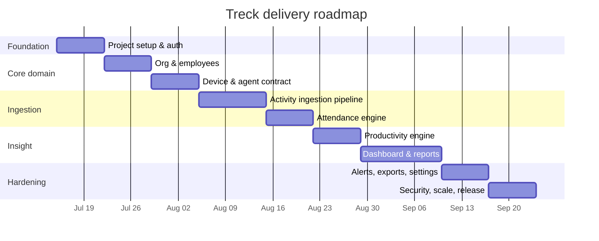

# 7. Development Roadmap

A phased plan that delivers a usable slice early and layers capability on top.
Durations assume a small team (1–2 backend, 1 frontend); adjust to your context.

## 7.1 Phases at a glance

## 7.2 Phase detail

### Phase 0 — Foundation & Authentication (Week 1)

- Scaffold Laravel 11, install **Breeze** (Livewire stack), **Sanctum**,
  **Spatie Permission**, Tailwind, Horizon (if Redis queues).
- `config/treck.php`, base layout (sidebar/topbar), CI (PHPUnit/Pest + Pint).
- Roles/permissions seeder; login/registration; user activation.
- **Deliverable**: a user can log into an empty, role-aware dashboard shell.

### Phase 1 — Organization & Employees (Week 2)

- Migrations/models: `departments`, `teams`, `employees`.
- Employee CRUD (Livewire) + Employee API resource; `TeamScope`; policies.
- Seeders/factories for realistic test data.
- **Deliverable**: manage the org chart and employee directory.

### Phase 2 — Device & Agent Contract (Week 3)

- `devices` table; device registration & pairing flow; agent token minting.
- `EnsureAgentToken` middleware; `GET /agent/config`.
- Publish the **agent API contract** (OpenAPI) so client-agent work can start
  in parallel.
- **Deliverable**: register/pair a device and fetch config; contract frozen.

### Phase 3 — Activity Ingestion Pipeline (Weeks 4–5)

- `work_sessions`, `activity_heartbeats`, `idle_periods` (+ partitioning).
- Session start/end + heartbeat batch endpoints (idempotent, bulk insert).
- `ProcessActivityBatch` job; Redis live status; `ReconcileStaleSessions`.
- Load test with a simulated fleet.
- **Deliverable**: agents (or a simulator) stream activity; live status works.

### Phase 4 — Attendance Engine (Week 6)

- `attendances` table; `DeriveDailyAttendance`, hourly + nightly rollups.
- Status classification (present/late/absent/half-day); holidays/leave.
- Attendance board + audited corrections.
- **Deliverable**: accurate daily attendance from raw telemetry.

### Phase 5 — Productivity Engine (Week 7)

- `applications`, `productivity_categories`, `app_usage_logs`,
  `productivity_reports`.
- App-usage ingestion; classification UI; scoring; unmatched-app surfacing.
- `GenerateProductivityReport` (daily/weekly).
- **Deliverable**: productivity scores and category breakdowns.

### Phase 6 — Dashboard & Reports (Weeks 8–9)

- Overview KPIs + charts; Live Monitor; per-employee timeline.
- Productivity & attendance reports with filters and cursor pagination.
- **Deliverable**: the full analytics dashboard.

### Phase 7 — Alerts, Exports & Settings (Week 10)

- Rule-based alerts (idle/offline/lateness/low-productivity) + notifications.
- CSV/PDF export jobs; per-organization settings UI; feature flags.
- **Deliverable**: operational tooling and configurability.

### Phase 8 — Security, Scale & Release (Week 11)

- Rate-limit tuning, token rotation, audit coverage review.
- Retention/pruning jobs; optional **Reverb** websockets; read-replica wiring.
- Security review, load test at target fleet size, docs, deploy runbook.
- **Deliverable**: production-ready v1.0.

## 7.3 Testing strategy

| Layer | Approach |
| ----- | -------- |
| Unit | Services & Actions (scoring, attendance derivation, idle rollup) with edge cases (midnight spans, missing logout, retries) |
| Feature | API endpoints (agent + user) incl. auth abilities, idempotency, validation, rate limits |
| Livewire | Component tests for tables, filters, corrections, authorization gates |
| Integration | End-to-end ingest → aggregate → report against a seeded fleet |
| Load | Simulated agent fleet at target size to validate p95 latency & queue depth |

CI runs Pint (style), PHPStan/Larastan (static analysis), and the full test
suite on every PR.

## 7.4 Definition of done (per feature)

- Migrations + models + factories.
- Form Request validation + Policy authorization.
- Service/Action with unit tests; controller/Livewire with feature tests.
- API Resource (if applicable) and updated OpenAPI.
- Audit logging on mutations; docs updated.

## 7.5 Key risks & mitigations

| Risk | Mitigation |
| ---- | ---------- |
| Heartbeat volume overwhelms DB | Bulk insert, monthly partitioning, queue back-pressure, aggregate-only reads |
| Agent network loss → gaps/dupes | Client buffering + idempotency keys + stale-session reconciliation |
| Privacy / compliance concerns | Data minimization by default, screenshot opt-in, retention limits, audit trail, employee purge |
| Clock skew between agents & server | Server timestamps authoritative; agent `at` used only for ordering within a session |
| Scope creep into surveillance | Explicit non-goals (no keystroke logging); feature flags keep invasive features off by default |
