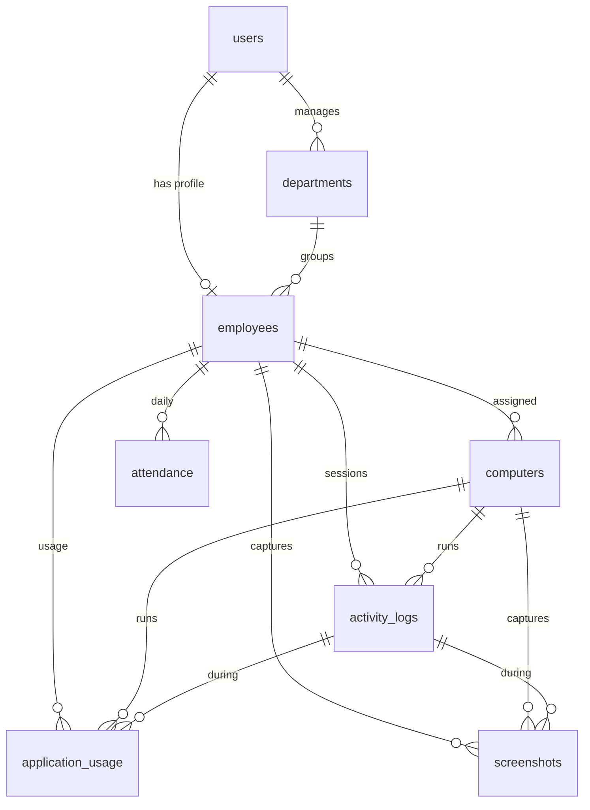

# 9. Database Migrations & Model Relationships

This document describes the concrete migration set delivered in
[`database/migrations/`](../database/migrations) and the Eloquent models in
[`app/Models/`](../app/Models). It covers the eight required tables, their
foreign keys, indexes, and how the models relate.

> These eight tables are the transactional core. The wider design in
> [doc 03](03-database-design.md) adds optional aggregate/catalog tables
> (productivity reports, application catalog, audit log); they layer on top of
> this core and are not required to start.

## 9.1 Tables & files

| Table | Migration file | Purpose |
| ----- | -------------- | ------- |
| `users` | `0001_01_01_000000_create_users_table.php` | Login accounts (+ `phone`, `is_active`) |
| `departments` | `2026_07_15_100001_create_departments_table.php` | Org units, each with an optional manager |
| `employees` | `2026_07_15_100002_create_employees_table.php` | HR profile, 1:1 with a user |
| `computers` | `2026_07_15_100003_create_computers_table.php` | Monitored workstations (agents) |
| `attendance` | `2026_07_15_100004_create_attendance_table.php` | Derived daily attendance summary |
| `activity_logs` | `2026_07_15_100005_create_activity_logs_table.php` | PC login/logout sessions + active/idle/status |
| `application_usage` | `2026_07_15_100006_create_application_usage_table.php` | Foreground app / URL usage |
| `screenshots` | `2026_07_15_100007_create_screenshots_table.php` | Opt-in screenshot metadata |

**Run order matters** — the file timestamps enforce it: `users` →
`departments` → `employees` → `computers` → `attendance` → `activity_logs` →
`application_usage` → `screenshots`, so every foreign key references an
already-created table.

> The `users` migration **replaces** Laravel's default
> `0001_01_01_000000_create_users_table.php` (same filename). It keeps the
> framework's `password_reset_tokens` and `sessions` tables and adds Treck's
> `phone` and `is_active` columns. Package tables (Sanctum
> `personal_access_tokens`, Spatie roles/permissions) are created by
> `php artisan migrate` from their own published migrations.

## 9.2 Entity relationship diagram



## 9.3 Foreign keys & on-delete behavior

| Child table | Column | References | On delete | Rationale |
| ----------- | ------ | ---------- | --------- | --------- |
| `departments` | `manager_id` | `users.id` | **SET NULL** | Department survives if the manager's account is removed |
| `employees` | `user_id` | `users.id` | **CASCADE** | The profile has no meaning without its login account |
| `employees` | `department_id` | `departments.id` | **SET NULL** | Employee stays if their department is dissolved |
| `computers` | `employee_id` | `employees.id` | **SET NULL** | Keep the device + its history when an employee leaves |
| `attendance` | `employee_id` | `employees.id` | **CASCADE** | Attendance is meaningless without the employee |
| `activity_logs` | `employee_id` | `employees.id` | **CASCADE** | Session belongs to the employee |
| `activity_logs` | `computer_id` | `computers.id` | **CASCADE** | Session belongs to the computer |
| `application_usage` | `employee_id` | `employees.id` | **CASCADE** | |
| `application_usage` | `computer_id` | `computers.id` | **CASCADE** | |
| `application_usage` | `activity_log_id` | `activity_logs.id` | **CASCADE** | Usage is scoped to its session (nullable) |
| `screenshots` | `employee_id` | `employees.id` | **CASCADE** | |
| `screenshots` | `computer_id` | `computers.id` | **CASCADE** | |
| `screenshots` | `activity_log_id` | `activity_logs.id` | **CASCADE** | Nullable |

`employees` and `computers` also use **soft deletes** (`deleted_at`), so
"deleting" them from the UI hides the record while retaining monitoring history;
a hard delete (e.g. right-to-erasure) is what triggers the cascades above.

In Laravel these are expressed fluently, e.g.:

```php
$table->foreignId('user_id')->unique()->constrained()->cascadeOnDelete();
$table->foreignId('department_id')->nullable()->constrained()->nullOnDelete();
$table->foreignId('manager_id')->nullable()->constrained('users')->nullOnDelete();
```

`constrained()` infers the referenced table from the column name
(`department_id` → `departments`); pass an explicit name when it differs
(`manager_id` → `users`).

## 9.4 Indexes

| Table | Index | Type | Why |
| ----- | ----- | ---- | --- |
| `users` | `email` | unique | Login lookup |
| `users` | `is_active` | index | Filter active users |
| `departments` | `name` | unique | No duplicate departments |
| `employees` | `user_id` | unique | Enforces 1:1 with users |
| `employees` | `employee_code` | unique | Business identifier |
| `computers` | `device_uuid` | unique | Stable agent identity |
| `computers` | `status`, `last_seen_at` | index | Live-status dashboards |
| `attendance` | `(employee_id, work_date)` | unique | One row per employee per day |
| `activity_logs` | `(employee_id, login_at)` | index | Employee session timelines |
| `activity_logs` | `(computer_id, login_at)` | index | Per-computer session lookups |
| `activity_logs` | `work_date` | index | Daily rollup grouping |
| `application_usage` | `(employee_id, used_at)` | index | Per-employee usage over time |
| `application_usage` | `(computer_id, used_at)` | index | Per-computer usage over time |
| `application_usage` | `application_name` | index | Group/aggregate by app |
| `screenshots` | `(employee_id, captured_at)` | index | Timeline of captures |

Foreign-key columns are automatically indexed by MySQL, so they are not listed
again above.

## 9.5 Model relationships

Each table maps to a model in `app/Models/`. The relationship methods:

| Model | Relationship | Method | Cardinality |
| ----- | ------------ | ------ | ----------- |
| `User` | → Employee | `employee()` `hasOne` | 1:1 |
| `User` | → Department (managed) | `managedDepartments()` `hasMany` | 1:N |
| `Department` | → User (manager) | `manager()` `belongsTo` | N:1 |
| `Department` | → Employee | `employees()` `hasMany` | 1:N |
| `Employee` | → User | `user()` `belongsTo` | 1:1 |
| `Employee` | → Department | `department()` `belongsTo` | N:1 |
| `Employee` | → Computer | `computers()` `hasMany` | 1:N |
| `Employee` | → Attendance | `attendance()` `hasMany` | 1:N |
| `Employee` | → ActivityLog | `activityLogs()` `hasMany` | 1:N |
| `Employee` | → ApplicationUsage | `applicationUsage()` `hasMany` | 1:N |
| `Employee` | → Screenshot | `screenshots()` `hasMany` | 1:N |
| `Computer` | → Employee | `employee()` `belongsTo` | N:1 |
| `Computer` | → ActivityLog | `activityLogs()` `hasMany` | 1:N |
| `Computer` | → ApplicationUsage | `applicationUsage()` `hasMany` | 1:N |
| `Computer` | → Screenshot | `screenshots()` `hasMany` | 1:N |
| `Attendance` | → Employee | `employee()` `belongsTo` | N:1 |
| `ActivityLog` | → Employee / Computer | `employee()` / `computer()` `belongsTo` | N:1 |
| `ActivityLog` | → ApplicationUsage / Screenshot | `applicationUsage()` / `screenshots()` `hasMany` | 1:N |
| `ApplicationUsage` | → Employee / Computer / ActivityLog | `belongsTo` | N:1 |
| `Screenshot` | → Employee / Computer / ActivityLog | `belongsTo` | N:1 |

### Plain-language summary

- **User ↔ Employee** is one-to-one: a `User` is the login/identity;
  the `Employee` is the HR profile. The `employees.user_id` unique constraint
  guarantees exactly one profile per account.
- **Department → Employees** is one-to-many: a department groups many employees;
  each employee belongs to at most one department. Separately, a `User` can be
  the **manager** of many departments (`departments.manager_id`).
- **Employee → Computers** is one-to-many: an employee can be assigned several
  workstations (desktop + laptop). Each computer belongs to one employee (or
  none, while unpaired).
- **Employee → Attendance** is one-to-many, but effectively one row per day
  (the unique index). It's the derived daily summary.
- **Employee/Computer → ActivityLog** — every PC login/logout session references
  both the employee and the computer it happened on.
- **ActivityLog → ApplicationUsage / Screenshots** — usage rows and screenshots
  are captured *within* a session, so they optionally point back to their
  `activity_log_id` as well as to the employee and computer for direct querying.

### Example queries the relationships enable

```php
// Today's open sessions with employee + computer eager-loaded
ActivityLog::with(['employee.user', 'computer'])
    ->whereNull('logout_at')
    ->whereDate('work_date', today())
    ->get();

// An employee's productive time today (sum of productive app usage)
$employee->applicationUsage()
    ->whereDate('used_at', today())
    ->where('productivity', 'productive')
    ->sum('duration_seconds');

// Attendance for a department on a given day
Attendance::whereDate('work_date', '2026-07-15')
    ->whereHas('employee', fn ($q) => $q->where('department_id', $deptId))
    ->get();
```

## 9.6 Applying the migrations

Once the Laravel project is scaffolded (see [doc 08](08-getting-started.md)):

```bash
php artisan migrate            # create all tables in dependency order
php artisan migrate:fresh      # drop & recreate (dev only) — wipes data
php artisan migrate:status     # see which migrations have run
```

Generate matching factories/seeders when you build each module:

```bash
php artisan make:factory EmployeeFactory --model=Employee
php artisan make:seeder EmployeeSeeder
```
