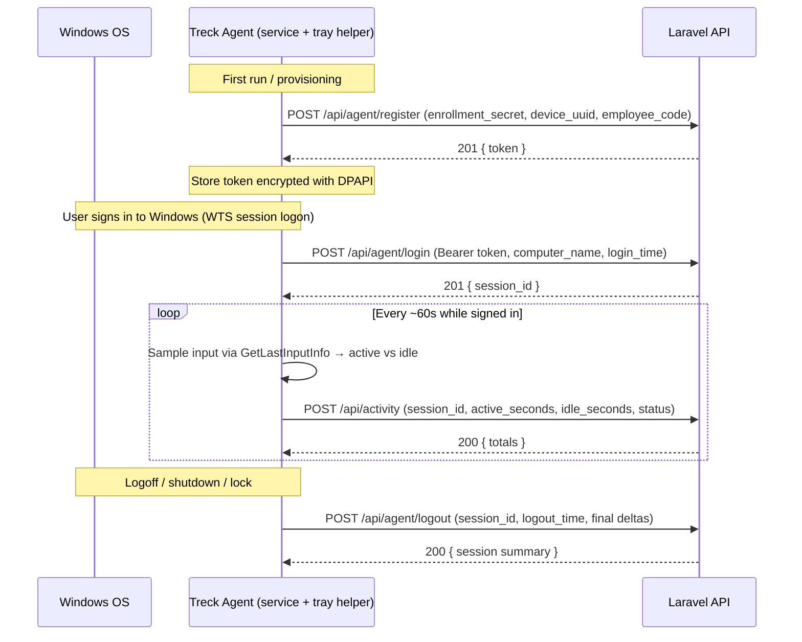

# 13. Desktop PC Agent API

The REST API the Windows (or macOS/Linux) desktop agent uses to report
workstation activity. Authenticated with **Laravel Sanctum device tokens** whose
tokenable is the `Computer` model.

## 13.1 Endpoints

| Verb | Path | Auth | Purpose |
| ---- | ---- | ---- | ------- |
| POST | `/api/agent/register` | Enrollment secret | Bootstrap: mint a device token |
| POST | `/api/agent/login` | Bearer (device) | Open a PC session (login time) |
| POST | `/api/activity` | Bearer (device) | Report active/idle seconds |
| POST | `/api/agent/logout` | Bearer (device) | Close the session (logout time) |
| POST | `/api/agent/events` | Bearer (device) | Drain a queued heartbeat/session/app-usage event (M6, Phase 7) |
| POST | `/api/agent/screenshots` | Bearer (device) | Drain a queued screenshot — multipart (Phase 8) |

The authenticated routes require the token's `agent:report` ability
(`ability:agent:report` middleware).

### 13.1.1 `POST /api/agent/events` (M6)

The landing endpoint for the agent's **offline queue**. The agent batches
heartbeat, session and application-usage events into a local SQLite queue and
drains them here; the server stores each event transactionally and only then
acknowledges, which is the signal the agent uses to delete its local copy.

Request body (snake_case, matching `Treck.Agent.Models.OfflineEventPayload`):

```json
{
  "kind": "heartbeat",              // or "session" or "app_usage"
  "idempotency_key": "a1b2c3…",     // agent-generated, unique per device
  "created_at": "2026-07-16T09:00:00Z",
  "payload": "{\"ElapsedSeconds\":60,\"ActiveSeconds\":50,\"IdleSeconds\":10}"
}
```

The valid `kind` values are the single source of truth in
`App\Enums\AgentEventKind` (`heartbeat`, `session`, `app_usage`) and are
validated on every request; an unknown kind is rejected with `422` before
anything is written. (The `agent_events.kind` column is a plain string — see
migration `2026_07_18_000002_relax_agent_events_kind_to_string` — so new kinds
need no schema change.)

`payload` is the opaque event body as a JSON **string**; it is stored verbatim
(decoded into a JSON column) for later projection into the domain tables.

Responses (both are success → the agent clears the event):

| Status | Meaning |
| ------ | ------- |
| `201 Created` | Stored for the first time (`data.duplicate = false`) |
| `200 OK` | Idempotent re-submission; already stored (`data.duplicate = true`) |
| `422` | Validation error (bad `kind`, missing field, non-JSON `payload`) |
| `401` / `403` | Missing/invalid token, or token lacks `agent:report` |

Idempotency is enforced per device by a unique `(computer_id, idempotency_key)`
index, so retries after a lost acknowledgement are safe. The owning employee is
resolved from the authenticated `Computer`, never from the body (SEC-1).

#### Presence projection (Phase 6)

For each **newly-stored** event, the ingest transaction also advances the
computer's materialized presence (`computer_presence`) via
`PresenceProjector`, and after commit broadcasts `PresenceChanged` on the
admin-only private channels `presence` and `presence.computer.{id}`:

```
store agent_events  ->  update computer_presence  ->  broadcast PresenceChanged
```

Duplicate submissions do not re-project or re-broadcast. Heartbeat payloads are
read for `IsIdle` (Active/Idle) and idle seconds; session payloads for `Type`
(Lock/Unlock/Logon/Logoff/...), accepted as either the string name or the numeric
`SessionEventType` ordinal so the agent needs no change. See
[`docs/25-realtime-presence.md`](25-realtime-presence.md) for the full design.

#### Application-usage projection (Phase 7)

`app_usage` events carry a **completed** foreground session (never per-second
samples). They do **not** affect presence and are not broadcast; instead they are
routed to `ApplicationUsageProjector`, which writes one `application_usage` row
per `(computer_id, SessionId)` — idempotent on top of the `agent_events` dedup.

```
store agent_events  ->  project into application_usage  (one row per session)
```

The payload uses PascalCase keys (read case-tolerantly):

```json
{
  "SessionId": "9f2c…",            // GUID; the per-session idempotency key
  "ProcessName": "Visual Studio Code",
  "ExecutableName": "Code.exe",
  "WindowTitle": "ApplicationUsage.php — treck",
  "ProcessId": 4321,
  "StartedAt": "2026-07-20T09:00:00Z",
  "EndedAt": "2026-07-20T09:05:00Z",
  "DurationSeconds": 300,
  "UserSession": 1,
  "IsSystemProcess": false
}
```

Only usage **metadata** is ever accepted or stored — never keystrokes, mouse
input, clipboard, screen contents, file contents, browser history or typed text.
Window titles are sanitized (control characters stripped, length-bounded) on both
the agent and the server. See [`docs/26-application-usage.md`](26-application-usage.md)
for the full design.

### 13.1.2 `POST /api/agent/screenshots` (Phase 8)

Screenshots are binary, so they use a dedicated **multipart** endpoint rather
than the JSON events pipe — but with the **same** device auth (`agent:report`),
the **same** offline-queue-first delivery, and the **same** idempotency
guarantees. The agent drains one queued screenshot per request.

Multipart fields:

| Field | Notes |
| ----- | ----- |
| `image` | The compressed JPEG/PNG file (validated: image mime, size-capped). |
| `captured_at` | ISO-8601 capture time. |
| `monitor_number` | 0-based monitor index. |
| `width` / `height` | Reported resolution (server re-derives via `getimagesize`). |
| `image_hash` | SHA-256 hex (server recomputes from the bytes; client value is advisory). |
| `active_process` / `active_window_title` | Foreground context (nullable). |
| `session_id` | Capture-session id tying a multi-monitor set together. |
| `source_session_id` / `source_user` / `source_process` / `collection_mode` | Event source metadata (Phase 8 #3): where the capture was collected (`InteractiveHelper` vs `Service`), for backend debugging (nullable). |

Responses (both 2xx → the agent clears the queue item and deletes its temp file):

| Status | Meaning |
| ------ | ------- |
| `201 Created` | Stored for the first time (`data.duplicate = false`) |
| `200 OK` | Duplicate — same device + identical image hash (`data.duplicate = true`) |
| `422` | Validation error (missing/oversize/non-image, bad field) |
| `401` / `403` | Missing/invalid token, or token lacks `agent:report` |

Duplicate detection is by a unique `(computer_id, image_hash)`; the SHA-256 is
computed **server-side** from the actual bytes, so identical or replayed captures
are stored once and the image file is written only for new content. The owning
employee is resolved from the `Computer`, never the body (SEC-1).

Image bytes are stored via Laravel Storage on a configurable, **non-public**
disk and are served only through a short-lived **signed** route
(`screenshots.image`) after an admin policy check — a filesystem path is never
exposed. Full design: [`docs/27-screenshot-module.md`](27-screenshot-module.md).

## 13.2 Delivered files

| File | Purpose |
| ---- | ------- |
| `routes/modules/agent.php` | Route definitions (include from `routes/api.php`) |
| `app/Http/Controllers/Api/Agent/DeviceRegistrationController.php` | `register` |
| `app/Http/Controllers/Api/Agent/WorkSessionController.php` | `login`, `logout` |
| `app/Http/Controllers/Api/Agent/ActivityController.php` | `activity` |
| `app/Http/Controllers/Api/Agent/EventIngestionController.php` | `events` (M6) |
| `app/Services/Agent/AgentEventIngestionService.php` | Transactional, idempotent ingest (M6); routes `app_usage` to its projector (Phase 7) |
| `app/Services/Presence/ApplicationUsageProjector.php` | Projects `app_usage` events into `application_usage` (Phase 7) |
| `app/Http/Controllers/Api/Agent/ScreenshotUploadController.php` | `screenshots` (Phase 8) |
| `app/Services/Screenshots/ScreenshotService.php` | Screenshot ingest (dedup) + read model (Phase 8) |
| `app/Services/Screenshots/ScreenshotStorageService.php` | Disk I/O + signed view URLs (Phase 8) |
| `app/Models/AgentEvent.php` | Stored event row (M6) |
| `app/Http/Requests/Agent/*.php` | Validation for each endpoint |
| `app/Models/Computer.php` | Gains `HasApiTokens` (device is the tokenable) |
| `bootstrap/app.php` | Registers Sanctum `ability`/`abilities` aliases |

Include the routes:

```php
// routes/api.php  (already prefixed with /api)
require __DIR__.'/modules/agent.php';
```

## 13.3 Sanctum authentication model

- The **device is the token holder.** `Computer` uses `HasApiTokens`, so
  `$computer->createToken('agent', ['agent:report'])` issues a token whose
  `tokenable_type` is `Computer`. On authenticated requests
  `$request->user()` returns the **Computer**.
- Tokens are **hashed at rest** (Sanctum default) and **revocable** per device
  (`$computer->tokens()->delete()`), so a lost/retired machine can be cut off.
- `register` is the only public endpoint; it is gated by a one-time
  **enrollment secret** (`TRECK_AGENT_ENROLLMENT_SECRET` →
  `config('treck.agent.enrollment_secret')`) checked in `RegisterDeviceRequest::authorize()`.

Add to `config/treck.php`:

```php
'agent' => [
    'enrollment_secret' => env('TRECK_AGENT_ENROLLMENT_SECRET'),
],
```

## 13.4 Request / response reference

### POST /api/agent/register

```jsonc
// Request (no bearer token; enrollment secret in the body)
{
  "enrollment_secret": "<one-time enrollment secret>",
  "device_uuid": "5f3c...hardware-fingerprint",
  "employee_code": "EMP-0042",
  "computer_name": "HR-PC-07",
  "os": "Windows 11",
  "agent_version": "1.0.0"
}
```
```jsonc
// 201 Created
{
  "message": "Device registered.",
  "data": {
    "computer_id": 12,
    "employee_id": 42,
    "token": "12|abcDEF...plaintext",   // store securely; shown once
    "token_type": "Bearer"
  }
}
```

### POST /api/agent/login

```jsonc
// Headers: Authorization: Bearer <device token>
{
  "computer_name": "HR-PC-07",
  "login_time": "2026-07-15T09:00:00Z"   // optional; server uses now() if omitted
}
```
```jsonc
// 201 Created
{
  "message": "Session started.",
  "data": { "session_id": 8801, "login_time": "2026-07-15T09:00:00+00:00" }
}
```
**SEC-1:** the employee is resolved server-side from the device's registration.
Any `employee_id` in the body is ignored; a device assigned to no employee gets
`409 Conflict`. Idempotent: if a session is already open for the device, its id
is returned instead of creating a duplicate.

### POST /api/activity

```jsonc
// Headers: Authorization: Bearer <device token>
{
  "session_id": 8801,
  "active_seconds": 55,     // measured since the last report (delta)
  "idle_seconds": 5,
  "status": "online"        // online | idle | locked | offline (optional)
}
```
```jsonc
// 200 OK — running totals echoed back
{
  "message": "Activity recorded.",
  "data": { "session_id": 8801, "active_seconds": 24100, "idle_seconds": 4700, "status": "online" }
}
```
`409 Conflict` if the session is already closed; `403` if the session belongs to
another device.

### POST /api/agent/logout

```jsonc
{
  "session_id": 8801,
  "logout_time": "2026-07-15T17:30:00Z",  // optional
  "active_seconds": 30,                    // optional final delta
  "idle_seconds": 0
}
```
```jsonc
// 200 OK
{
  "message": "Session ended.",
  "data": {
    "session_id": 8801,
    "login_time": "2026-07-15T09:00:00+00:00",
    "logout_time": "2026-07-15T17:30:00+00:00",
    "active_seconds": 24130,
    "idle_seconds": 4700
  }
}
```
Idempotent: closing an already-closed session returns `200` without change.

### Error shape

Validation failures return Laravel's standard `422`:

```jsonc
{ "message": "The session id field is required.",
  "errors": { "session_id": ["The session id field is required."] } }
```

`401` for a missing/invalid token, `403` for a token without `agent:report` or a
cross-device access attempt.

## 13.5 Data mapping

| Requested field | Stored as |
| --------------- | --------- |
| Employee ID | `activity_logs.employee_id` |
| Computer Name | `computers.hostname` (updated on register/login) |
| Login Time | `activity_logs.login_at` |
| Logout Time | `activity_logs.logout_at` |
| Active Seconds | `activity_logs.active_seconds` (accumulated) |
| Idle Seconds | `activity_logs.idle_seconds` (accumulated) |

Each `login → activity* → logout` cycle is one `activity_logs` row (a PC
session). Daily `attendance` and productivity rollups are derived from these
rows by scheduled jobs (docs 01 & 03) — the agent never writes them directly.

## 13.6 How the Windows agent communicates



### Windows implementation notes

- **Process model:** a **Windows Service** (runs as `LocalSystem`, survives
  reboots, auto-starts) plus a lightweight **per-session tray helper** launched
  in the interactive user session. Idle detection (`GetLastInputInfo`) only
  works inside a user session, so the helper measures activity and the service
  performs the HTTPS calls (or the helper calls directly).
- **Session events:** subscribe to `WM_WTSSESSION_CHANGE`
  (`WTSRegisterSessionNotification`) for logon/logoff/lock/unlock, and handle
  `SERVICE_CONTROL_SHUTDOWN`/`SERVICE_CONTROL_PRESHUTDOWN` to send `logout`
  before the machine powers off.
- **Idle vs active:** each tick (e.g. 60s), compute idle milliseconds from
  `GetLastInputInfo`. If idle exceeds the configured threshold
  (`TRECK_IDLE_THRESHOLD`, default 300s) the elapsed time counts as
  `idle_seconds`, otherwise `active_seconds`. `status` becomes `locked` on
  session-lock events.
- **Transport:** HTTPS with `Authorization: Bearer <token>`. Use `HttpClient`
  (.NET) / WinHTTP. Always send `Accept: application/json`.
- **Resilience:** buffer reports to a local queue (e.g. SQLite/JSON) when
  offline and flush on reconnect; retry with exponential backoff. Endpoints are
  idempotent (open-session reuse on `login`, no-op close on `logout`), so
  retries are safe. Server timestamps are authoritative — the agent's
  `*_time` fields are advisory for ordering.
- **Token storage:** persist the Sanctum token in **Windows Credential Manager**
  / DPAPI, never in plain text. On `401`, re-run registration to obtain a fresh
  token.
- **Clock skew:** send `active_seconds`/`idle_seconds` as **durations** (deltas),
  not derived from wall-clock differences, so skew between the PC and server
  can't corrupt totals.

### Minimal C# example (activity tick)

```csharp
using var http = new HttpClient { BaseAddress = new Uri("https://treck.example.com") };
http.DefaultRequestHeaders.Authorization = new("Bearer", token);
http.DefaultRequestHeaders.Accept.Add(new("application/json"));

var body = new {
    session_id = sessionId,
    active_seconds = activeDelta,
    idle_seconds = idleDelta,
    status = isLocked ? "locked" : (idleDelta > 0 ? "idle" : "online")
};

var res = await http.PostAsJsonAsync("/api/activity", body);
// On failure: enqueue `body` locally and retry with backoff.
```

## 13.7 Try it with curl

```bash
# 1. Register (needs TRECK_AGENT_ENROLLMENT_SECRET set and an existing employee code)
curl -sX POST https://treck.test/api/agent/register \
  -H 'Accept: application/json' \
  -d enrollment_secret=SECRET -d device_uuid=DEMO-UUID -d employee_code=EMP-0042 \
  -d computer_name=HR-PC-07 -d os='Windows 11'
# → { "data": { "token": "12|..." } }

TOKEN=12|...

# 2. Login (open a session)
curl -sX POST https://treck.test/api/agent/login \
  -H "Authorization: Bearer $TOKEN" -H 'Accept: application/json' \
  -d computer_name=HR-PC-07
# → { "data": { "session_id": 8801 } }

# 3. Activity
curl -sX POST https://treck.test/api/activity \
  -H "Authorization: Bearer $TOKEN" -H 'Accept: application/json' \
  -d session_id=8801 -d active_seconds=55 -d idle_seconds=5 -d status=online

# 4. Logout
curl -sX POST https://treck.test/api/agent/logout \
  -H "Authorization: Bearer $TOKEN" -H 'Accept: application/json' \
  -d session_id=8801
```

---

## Phase 9 note — Notifications

Agent-observable signals feed the Phase 9 notification engine. Presence changes
and completed application-usage sessions (already ingested via the endpoints
above) are evaluated automatically against configurable rules; agent/system
health failures (registration failed, heartbeat stopped, repeated sync failures,
growing queue) are modelled as notification event types and are ready to be
driven by dedicated agent-fed signals. No new agent endpoint is required for
Phase 9. Full design: [`docs/29-notifications.md`](29-notifications.md).

---

## Phase 11 note — Windows identity for shared computers

Every event payload now carries the interactive Windows username (`SourceUser`
and the explicit `WindowsUsername` alias); screenshot uploads add a
`windows_username` field alongside `source_user`. The agent still reports only
the Windows identity — never an employee or manager id. The server resolves
`computer + windows_username → employee` (falling back to the computer's
assigned employee when absent), so no new agent endpoint is required and legacy
agents keep working. Full design:
[`docs/31-multi-user-computer-and-manager-hierarchy.md`](31-multi-user-computer-and-manager-hierarchy.md).
