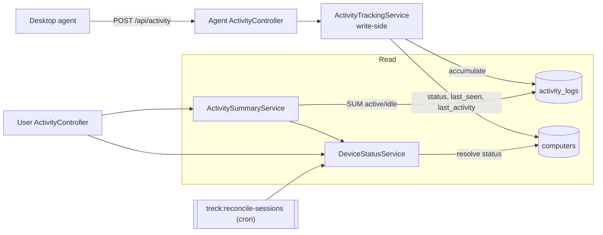

# 14. Employee Activity Tracking System

This is the layer that turns raw PC sessions (from the [agent API](13-agent-api.md))
into the four tracked metrics — **active time**, **idle time**,
**online/offline status**, and **last activity timestamp** — using a clean
three-service split.

## 14.1 Design overview



**Separation of concerns**

| Class | Side | Responsibility |
| ----- | ---- | -------------- |
| `ActivityTrackingService` | write | Accumulate active/idle deltas onto the open session; refresh computer status, `last_seen_at`, `last_activity_at` — atomically |
| `DeviceStatusService` | status | Resolve effective online/offline (with staleness), employee status, last-activity; reconcile abandoned sessions |
| `ActivitySummaryService` | read | Compute active/idle totals, ratio, and status for an employee (day or range) |

Controllers stay thin: they validate, authorize, delegate to a service, and
shape the response.

## 14.2 The four metrics

### Active & idle time
The agent reports **deltas** (seconds active vs idle since its last report).
`ActivityTrackingService::record()` accumulates them onto the open
`activity_logs` row using atomic `increment()` (so concurrent writes can't lose
counts). Totals per employee/day come from `ActivitySummaryService` with a
single grouped `SUM` query — dashboards never scan raw samples.

```
active_ratio = 100 * active_seconds / (active_seconds + idle_seconds)
```

### Online / offline status
Stored `computers.status` is the last self-reported state. `DeviceStatusService`
layers a **staleness check** on top:

```
if last_seen_at is null OR older than offline_grace  → offline
else                                                 → stored status
```

So a crashed agent that never sent a logout still reads as **offline** once the
grace window (`TRECK_OFFLINE_GRACE`, default 180s) passes. `employeeStatus()`
rolls a person's computers up to their "most active" state
(online > idle > locked > offline).

### Last activity timestamp
`computers.last_activity_at` (added by migration
`…100008_add_last_activity_at_to_computers_table`) is bumped **only when there
was real input** (`activeDelta > 0` and status online) — distinct from
`last_seen_at`, which every heartbeat (including idle) refreshes.
`DeviceStatusService::lastActivityAt($employee)` returns the max across their
computers.

## 14.3 Offline detection (database logic)

Webhooks/heartbeats can't tell us when an agent *dies*. The
`treck:reconcile-sessions` command calls `DeviceStatusService::reconcileStale()`,
which, in a transaction per computer:

1. finds computers not already offline whose `last_seen_at` is null or older
   than the grace window,
2. closes any still-open session with `end_reason = timeout`,
3. sets the computer's status to `offline`.

Schedule it in `routes/console.php` (Laravel 11):

```php
use Illuminate\Support\Facades\Schedule;

Schedule::command('treck:reconcile-sessions')->everyMinute();
```

## 14.4 Delivered files

| File | Purpose |
| ---- | ------- |
| `app/Services/Activity/ActivityTrackingService.php` | Write-side accumulation |
| `app/Services/Activity/ActivitySummaryService.php` | Read-side calculation |
| `app/Services/Device/DeviceStatusService.php` | Status resolution + reconcile |
| `app/Http/Controllers/Api/Agent/ActivityController.php` | Refactored to use the tracking service |
| `app/Http/Controllers/Api/V1/User/ActivityController.php` | `live` + `summary` read endpoints |
| `app/Console/Commands/ReconcileStaleSessions.php` | Scheduled offline sweep |
| `database/migrations/…100008_add_last_activity_at_to_computers_table.php` | `last_activity_at` column |
| `routes/modules/activity.php` | Read-API routes |

## 14.5 Read API

Include from `routes/api.php`: `require __DIR__.'/modules/activity.php';`

### GET /api/v1/activity/live
Requires `view attendance`. Returns every computer's effective status:

```jsonc
{ "data": [
  { "computer_id": 12, "hostname": "HR-PC-07", "employee": "A. Rahman",
    "status": "online",
    "last_seen_at": "2026-07-15T09:42:00+00:00",
    "last_activity_at": "2026-07-15T09:41:30+00:00" }
]}
```

### GET /api/v1/activity/{employee}/summary?date=YYYY-MM-DD
Admins (or the employee themselves):

```jsonc
{ "data": {
  "employee_id": 42, "date": "2026-07-15",
  "active_seconds": 24100, "idle_seconds": 4700,
  "active_hours": 6.69, "idle_hours": 1.31, "active_ratio": 83.7,
  "status": "online", "is_online": true,
  "last_activity_at": "2026-07-15T09:41:30+00:00"
}}
```

## 14.6 Using the services elsewhere

The services are resolvable from the container, so the Livewire dashboard
(doc 06) uses the same logic:

```php
public function render(ActivitySummaryService $summary, DeviceStatusService $status)
{
    return view('livewire.dashboard.overview', [
        'today'   => $summary->dailySummary($this->employee),
        'trend'   => $summary->rangeByDay($this->employee, now()->subDays(14), now()),
        'devices' => Computer::with('employee.user')->get()
                        ->map(fn ($c) => [$c, $status->resolve($c)]),
    ]);
}
```

## 14.7 Notes

- Requires `config('treck.activity.offline_grace_seconds')` (doc 02 §2.3).
- Because computers track live state, the read path stays index-friendly
  (`computers.status`, `last_seen_at`) and the calc path reads only accumulated
  `activity_logs`.
- This feeds the next layer — daily `attendance` and `productivity_reports`
  rollups — which aggregate the same `activity_logs` on a schedule (docs 01 & 03).
