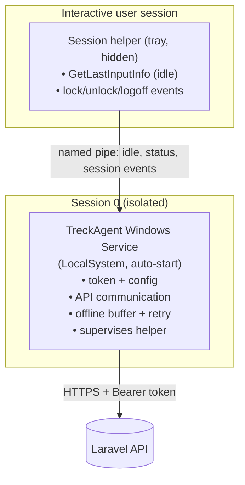
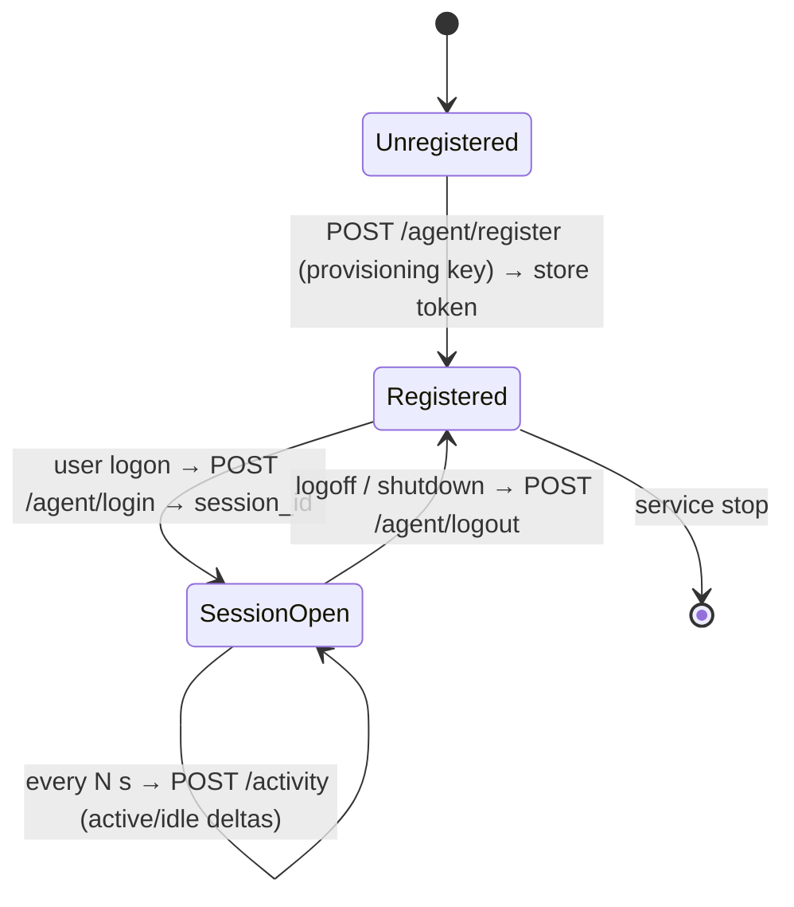

# 17. Windows PC Agent (C#)

The desktop client that runs on each employee workstation, detects login/logout,
measures keyboard/mouse inactivity, and streams activity to the Laravel
[agent API](13-agent-api.md). Built as a **.NET 8 Windows Service**.

A reference implementation lives in [`/agent`](../agent).

## 17.1 Agent architecture

### The session-0 problem (why two parts)

A Windows **Service** runs in **session 0**, isolated from the interactive
desktop. `GetLastInputInfo` — the API for keyboard/mouse idle time — only
reports input for the session the caller runs in. So a service alone **cannot**
measure the logged-in user's activity. The robust design splits responsibilities:



| Component | Runs as | Responsibility |
| --------- | ------- | -------------- |
| **Service** | LocalSystem, session 0 | Startup persistence, holds the Sanctum token, all HTTPS calls, offline buffering/retry, launches + supervises the helper |
| **Session helper** | Interactive user | Reads idle time (`GetLastInputInfo`), detects lock/unlock/logoff (`WTS`/`SystemEvents`), forwards samples to the service over a named pipe |

> The reference project ships the shared building blocks (`IdleDetector`,
> `SessionMonitor`, `ApiClient`, `TokenStore`, `ActivityTracker`) and a `Worker`
> that wires them together. In a single-session deployment the Worker can host
> the sensors directly; for full multi-user/session-0 correctness, deploy the
> sensing classes in the helper and keep networking in the service, bridged by a
> named pipe. The class contracts are identical either way.

### Lifecycle / state machine



### Activity classification (each tick)

Every `HeartbeatIntervalSeconds` (default 60):

```
elapsed   = seconds since last tick
idle      = GetLastInputInfo() seconds
if session locked           → status = Locked, idle  += elapsed
else if idle >= threshold   → status = Idle,   idle  += elapsed   (TRECK_IDLE_THRESHOLD, default 300s)
else                        → status = Online, active += elapsed
POST /api/activity { session_id, active_seconds, idle_seconds, status }
```

Reporting **durations (deltas)**, not wall-clock differences, keeps totals
correct regardless of clock skew between PC and server.

## 17.2 C# project structure

```
agent/
├── Treck.Agent.csproj          # .NET 8 Worker Service (net8.0-windows)
├── appsettings.json            # BaseUrl, provisioning key, intervals, threshold
├── Program.cs                  # Host builder, AddWindowsService, DI wiring
├── Worker.cs                   # BackgroundService: register → login → tick → logout
├── Configuration/
│   └── AgentOptions.cs         # Strongly-typed config
├── Services/
│   ├── ApiClient.cs            # Typed HttpClient: register/login/activity/logout + retry
│   ├── IdleDetector.cs         # P/Invoke GetLastInputInfo → idle seconds
│   ├── SessionMonitor.cs       # Lock/unlock/logoff via SystemEvents
│   ├── ActivityTracker.cs      # Pure classification logic (active/idle/status)
│   └── TokenStore.cs           # DPAPI-encrypted token + device id + employee id
└── Models/
    └── ApiModels.cs            # Request/response DTOs + AgentStatus enum
```

Key packages: `Microsoft.Extensions.Hosting.WindowsServices` (run as a service),
`Microsoft.Extensions.Http` (typed client), `System.Security.Cryptography.ProtectedData`
(DPAPI).

### Start with Windows / run silently

- Registered as a **Windows Service** with `StartType=Automatic` → starts at boot
  regardless of interactive login, and restarts on crash via service recovery.
- No window/UI in the service; the helper is a hidden tray process. Nothing is
  shown to the user beyond what your policy chooses to surface.

Install (elevated):

```powershell
dotnet publish -c Release -r win-x64 --self-contained
sc.exe create TreckAgent binPath= "C:\Program Files\Treck\TreckAgent.exe" start= auto
sc.exe failure TreckAgent reset= 86400 actions= restart/5000/restart/5000/restart/5000
sc.exe start TreckAgent
```

## 17.3 API communication design

Uses the four endpoints from [doc 13](13-agent-api.md):

| Step | Call | When |
| ---- | ---- | ---- |
| Bootstrap | `POST /api/agent/register` (provisioning key) | First run only; stores the returned token + `employee_id` |
| Session start | `POST /api/agent/login` (Bearer) | On user logon |
| Heartbeat | `POST /api/activity` (Bearer) | Every `HeartbeatIntervalSeconds` |
| Session end | `POST /api/agent/logout` (Bearer) | On logoff / shutdown / service stop |

- **Transport:** `HttpClient` over HTTPS, `Authorization: Bearer <token>`,
  `Accept: application/json`. JSON uses snake_case to match the API.
- **Resilience:** each call retries with exponential backoff
  (`MaxRetries`); failed activity reports are queued locally and flushed on
  reconnect. Endpoints are idempotent (login reuses an open session, logout is a
  no-op if already closed), so retries are safe.
- **Re-auth:** on `401`, the stored token is discarded and the agent
  re-registers to obtain a fresh one.
- **Clock:** the server timestamps are authoritative; the agent sends durations.

## 17.4 Security considerations

- **Token at rest:** stored with **DPAPI** (`ProtectedData`, `LocalMachine`
  scope) under `%ProgramData%\TreckAgent`, never in plain text or in the binary.
  The provisioning key is only used once and is not persisted by the agent.
- **Transport:** TLS 1.2+ enforced; optional **certificate pinning**
  (`HttpClientHandler.ServerCertificateCustomValidationCallback`) for
  high-assurance deployments.
- **Least privilege:** the service runs as `LocalSystem` only for
  startup/persistence; the sensing helper runs as the ordinary user. No admin
  rights are needed at runtime beyond install.
- **Data minimization / privacy:** the agent reports **aggregate signals only**
  — active/idle seconds and lock state. It does **not** capture keystrokes,
  window text, or content. Screenshots remain an opt-in server feature, off by
  default. This should be disclosed to employees per policy/law.
- **Tamper resistance:** service recovery auto-restarts the process;
  ship a **code-signed** binary; restrict file/registry ACLs on the install and
  state directories so non-admins can't read the token or alter config.
- **Integrity of identity:** the device token is bound to one `Computer`;
  revoking it server-side (`$computer->tokens()->delete()`) instantly cuts the
  machine off.
- **Updates:** distribute via MSI/MDM (Intune/SCCM); the agent can check
  `agent_version` so the server can flag out-of-date clients.

## 17.5 Mapping to the API contract

| Agent measurement | Sent as | Stored (doc 13/14) |
| ----------------- | ------- | ------------------ |
| Real input in interval | `active_seconds` | `activity_logs.active_seconds` |
| No input ≥ threshold | `idle_seconds` | `activity_logs.idle_seconds` |
| Session lock | `status=locked` | `activity_logs.status`, `computers.status` |
| Logon / logoff time | `login`/`logout` calls | `activity_logs.login_at`/`logout_at` |

The reference code is in [`/agent`](../agent). It targets `net8.0-windows`; it
cannot be compiled or linted in this (Linux) repo environment, so treat it as a
correct-by-inspection reference to build on a Windows/.NET toolchain.
