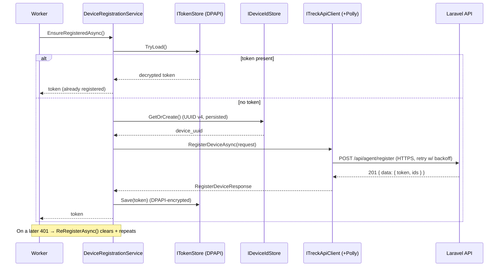

# 24. Windows Agent — Milestone Build

The desktop agent (`agent/`) is built incrementally as a **.NET 8 Worker
Service**. Each milestone is self-contained and testable before the next
begins. This supersedes the earlier all-at-once reference sketch (the design
rationale in [doc 17](17-windows-agent.md) still applies).

## Milestone roadmap

| # | Scope | Requirements | Status |
| - | ----- | ------------ | ------ |
| **M1** | Skeleton, configuration, structured logging, service lifecycle | 9, 10 | ✅ Complete |
| **M2** | API client + device registration + token storage | 1, 2, 3, 4, 5, 6, 7, 8, 12, 13, 14 | ✅ Complete |
| **M3** | Windows session detection (logon/logoff/lock/unlock/shutdown) | — | ✅ Complete |
| **M4** | Idle-time calculation (Win32) + 60s heartbeat | 5, 6 | ✅ Complete |
| M5 | Reconnect on network failure + SQLite offline cache | 7, 8 | Planned |
| M6 | Windows Service packaging & install | — | Planned |

---

## M1 — Skeleton, configuration & structured logging ✅

### Architecture

- **Generic Host + Worker Service.** `Program.cs` builds a
  `HostApplicationBuilder`, registers the app as a Windows Service
  (`AddWindowsService`), and hosts a single `BackgroundService` (`Worker`). The
  same binary runs as a console app in development and as a service in
  production.
- **Configuration.** `AgentOptions` is bound from the `Agent` section of
  `appsettings.json` and **validated at startup** (`ValidateDataAnnotations` +
  `ValidateOnStart`) — the process refuses to start on invalid config
  (fail-fast), which is far safer than discovering a bad URL mid-run.
- **Structured logging.** Serilog is configured from the `Serilog` section:
  a human-readable **console** sink and a rolling **compact-JSON** file sink
  (`logs/treck-agent-<date>.jsonl`, 14-day retention). A bootstrap logger
  captures failures that occur before the host is built. All logs carry
  `MachineName`; later milestones add correlation properties (session id, etc.).
- **Lifecycle.** `Worker` logs a startup banner, then ticks on a
  `PeriodicTimer` at `HeartbeatIntervalSeconds`, and logs a clean stop on
  cancellation. No API/idle/session logic yet — that is deliberately deferred.

### Folder structure

```
agent/
├── Treck.Agent.csproj
├── Program.cs
├── Worker.cs
├── Configuration/AgentOptions.cs
├── appsettings.json
├── appsettings.Development.json
└── .gitignore
```

### How to test

1. **Build:** `cd agent && dotnet restore && dotnet build` — succeeds with no
   warnings (`TreatWarningsAsErrors` is on).
2. **Run:** `dotnet run` — expect a structured startup banner naming the server,
   employee code, and intervals, then a `Debug` "alive tick" each interval.
   (Set `DOTNET_ENVIRONMENT=Development` to see Debug ticks; production level is
   Information.)
3. **Logging:** confirm `agent/logs/treck-agent-<date>.jsonl` is created and each
   line is valid JSON.
4. **Config validation (fail-fast):** blank out `Agent:BaseUrl` in
   `appsettings.json` and run — startup should throw an
   `OptionsValidationException` and exit non-zero.
5. **Config override:** `Agent__HeartbeatIntervalSeconds=10 dotnet run` (env var)
   → ticks every 10s, proving configuration binding.
6. **Graceful shutdown:** Ctrl+C → a single "Treck Agent stopped." line, exit 0.

### Definition of done

Service boots, validates config, emits structured console + JSON-file logs, and
ticks on schedule; invalid config fails fast. ✅

---

---

## M2 — Device registration & API communication ✅

### Architecture

SOLID layering — every collaborator is an interface, wired by DI, so each is
unit-testable in isolation:

- **Api/** — `ITreckApiClient` / `TreckApiClient`: a **typed HttpClient**
  registered through `IHttpClientFactory`, with a **Polly** retry policy
  (exponential backoff on 5xx/408/429/network errors) and a `SocketsHttpHandler`
  that keeps **default TLS certificate validation** and requires TLS 1.2/1.3.
  Single responsibility: (de)serialize snake_case JSON and map the envelope.
  `ApiException`/`UnauthorizedApiException` model failures (req 13).
- **Security/** — `ITokenProtector` / `DpapiTokenProtector`: encrypts the token
  with **Windows DPAPI** (`ProtectedData`, LocalMachine scope + entropy). Only
  ciphertext is written (reqs 8, 9).
- **Storage/** — `IStoragePathProvider` (base dir), `IDeviceIdStore` /
  `FileDeviceIdStore` (persistent **UUID v4**, reqs 4, 5), `ITokenStore` /
  `DpapiTokenStore` (encrypted token file; decrypt-on-load, req 10).
- **Services/** — `IDeviceRegistrationService` / `DeviceRegistrationService`:
  orchestrates id + API + token store. `EnsureRegisteredAsync` returns the
  stored token if present, else registers (reqs 6, 7); `ReRegisterAsync` clears
  and re-registers on an invalid token (req 11). Structured logs on every
  attempt, never logging the key or token (req 14).
- **Models/** — typed request/response DTOs + `ApiEnvelope<T>` (req 12).

The token is resolved by the Laravel side from the device's registration
(SEC-1), so the agent never sends an employee id.

### Folder structure

```
agent/
├── Treck.Agent.sln                  # solution: Treck.Agent + Treck.Agent.Tests
├── Treck.Agent.csproj               # excludes tests/** from its compile items
├── Program.cs                       # DI, IHttpClientFactory, Polly, TLS handler
├── Worker.cs                        # ensures registration on start (retries per tick)
├── Api/
│   ├── ITreckApiClient.cs
│   ├── TreckApiClient.cs
│   └── ApiException.cs
├── Configuration/AgentOptions.cs
├── Models/
│   ├── ApiEnvelope.cs
│   ├── RegisterDeviceRequest.cs
│   └── RegisterDeviceResponse.cs
├── Security/
│   ├── ITokenProtector.cs
│   └── DpapiTokenProtector.cs
├── Services/
│   ├── IDeviceRegistrationService.cs
│   └── DeviceRegistrationService.cs
├── Storage/
│   ├── IStoragePathProvider.cs / StoragePathProvider.cs
│   ├── IDeviceIdStore.cs / FileDeviceIdStore.cs
│   └── ITokenStore.cs / DpapiTokenStore.cs
└── tests/Treck.Agent.Tests/         # xUnit + Moq + coverlet.collector
    ├── Treck.Agent.Tests.csproj     # ProjectReference → ../../Treck.Agent.csproj
    └── *Tests.cs
```

**Build system.** The test project is nested under `agent/`, so the main
`Treck.Agent.csproj` sets `DefaultItemExcludes` to skip `tests/**` — it never
compiles test files or takes a dependency on test packages. `Treck.Agent.sln`
ties both projects together for `dotnet build` / `dotnet test`.

### Registration sequence



### How to test

1. **Build + unit tests:** `cd agent && dotnet test` — runs the xUnit suite
   (DPAPI round-trip [Windows], device-id persistence, registration client
   request/response + error mapping, registration-service orchestration).
2. **Live registration (happy path):** with the Laravel API running and
   `TRECK_AGENT_PROVISIONING_KEY` + a valid `EmployeeCode` set, `dotnet run` →
   logs "Registering device …" then "Device registered: computerId=…". Confirm
   `%ProgramData%\TreckAgent\device.id` (plaintext UUID) and `token.dat`
   (unreadable ciphertext, **not** the bearer token) exist.
3. **Decrypt-on-startup:** stop and re-run → logs "Device already registered;
   using stored token." (no second API call).
4. **Retry/backoff:** point `BaseUrl` at an unreachable host → observe
   "HTTP retry 1/…", "2/…" with doubling delays, then a graceful warning; the
   service keeps running and retries each interval.
5. **Bad provisioning key:** wrong key → API 403 → `ApiException` logged, agent
   stays up and retries.

### Unit tests (delivered)

`agent/tests/Treck.Agent.Tests/`: `DpapiTokenProtectorTests`,
`FileDeviceIdStoreTests`, `TreckApiClientTests`, `DeviceRegistrationServiceTests`.

### Definition of done

Device generates + persists a UUID, registers over validated HTTPS with retry,
stores the token DPAPI-encrypted, decrypts it on restart, and re-registers on
invalidation — all interface-driven and unit-tested. ✅

---

---

## M3 — Windows session detection ✅

### Architecture

Event-driven, no polling, split into a testable core + native adapter:

- **`ISessionMonitor`** — `Start()` / `Stop()` and a `SessionChanged` event;
  the internal publisher (no API involvement).
- **`SessionMonitorBase`** — platform-agnostic core: thread-safe start/stop
  (lock-guarded), **duplicate suppression** (drops consecutive identical events
  within `DuplicateSuppressionMilliseconds`, via an injected `TimeProvider`),
  structured logging, and event raising **outside the lock** (no handler
  reentrancy/deadlock). This is what the unit tests exercise.
- **`WindowsSessionMonitor : SessionMonitorBase`** — native adapter using
  `Microsoft.Win32.SystemEvents` (a managed wrapper over WM_WTSSESSION_CHANGE /
  WM_ENDSESSION). Maps `SessionSwitch`→ Logon/Logoff/Lock/Unlock and
  `SessionEnding`→ Logoff/Shutdown, then calls `Publish`. `[SupportedOSPlatform("windows")]`.
- **`SessionEvent`** (`Type`, `TimestampUtc`), **`SessionEventType`** (Unknown,
  Logon, Logoff, Lock, Unlock, Shutdown, Restart), **`SessionMonitorOptions`**.

The `Worker` starts the monitor and subscribes, logging each event — **it does
not call the API** (that begins in M4).

Two honest limitations, documented in code:
- **Restart vs. shutdown** isn't reliably distinguishable through this API; a
  system-ending notification surfaces as `Shutdown`. `Restart` stays in the enum
  for when a lower-level hook is added.
- `SystemEvents` delivers to the interactive desktop session, so the monitor is
  intended for the per-user session context (helper) per doc 17; a pure
  session-0 service would hook `ServiceBase.OnSessionChange` instead — the
  `SessionMonitorBase` contract is unchanged.

### Folders added

```
agent/Sessions/
├── ISessionMonitor.cs
├── SessionMonitorBase.cs        # thread-safe dedup + publish (testable)
├── WindowsSessionMonitor.cs     # SystemEvents adapter (Windows-only)
├── SessionEvent.cs
├── SessionEventType.cs
└── SessionMonitorOptions.cs
```

### Sequence

```mermaid
sequenceDiagram
    participant OS as Windows (SystemEvents)
    participant M as WindowsSessionMonitor
    participant B as SessionMonitorBase
    participant W as Worker

    W->>M: Start()  (subscribe SessionSwitch/SessionEnding)
    Note over OS: user locks the workstation
    OS-->>M: SessionSwitch(SessionLock)
    M->>B: Publish(Lock)
    B->>B: dedup check (lock + TimeProvider)
    B-->>W: SessionChanged(Lock)  (logged; no API)
    Note over OS: duplicate lock within window
    OS-->>M: SessionSwitch(SessionLock)
    M->>B: Publish(Lock)
    B->>B: within suppression window → dropped
```

### How to test

- **Unit (`dotnet test`)** — `SessionMonitorTests` covers: event raised with
  correct type/timestamp; duplicate same-type suppressed within the window;
  different types allowed; same type allowed after the window elapses (time
  advanced via a mutable `TimeProvider`); zero-window never suppresses.
- **Manual (Windows, `dotnet run`)** — lock (Win+L) / unlock, sign out, and shut
  down; observe structured `Session event: Lock/Unlock/Logoff/Shutdown …` log
  lines. Rapidly locking twice should log one Lock (dedup).

### Definition of done

Session transitions are detected via native notifications (no polling),
de-duplicated, thread-safe, structured-logged, and published internally; core
logic unit-tested. No API calls. ✅

---

---

## M4 — Idle detection & heartbeat ✅

### Architecture

Idle detection and heartbeat scheduling are fully separate from API
communication (the heartbeat path has no reference to `ITreckApiClient` or the
registration service):

- **`IIdleDetector` / `WindowsIdleDetector`** — Win32 `GetLastInputInfo` only;
  returns the idle `TimeSpan`. `[SupportedOSPlatform("windows")]`.
- **`HeartbeatCalculator`** (pure, static) — given `elapsed`, observed
  `idleTime`, and the configured threshold, classifies the interval into
  active vs. idle seconds. No I/O → fully unit-tested.
- **`HeartbeatEvent`** — the internal model (timestamp, elapsed, observed idle,
  `IsIdle`, active/idle seconds). Not sent anywhere in M4.
- **`IHeartbeatScheduler` / `HeartbeatScheduler`** — owns a `PeriodicTimer`
  (constructed with the injected `TimeProvider` for testable timing) at
  `HeartbeatIntervalSeconds` (default 60). Each tick reads the idle detector,
  builds a `HeartbeatEvent`, logs it, and raises `HeartbeatProduced`. The
  per-tick logic is factored into `CaptureHeartbeat()` (public) so it can be
  unit-tested without real time.

The idle **threshold** and heartbeat **interval** come from `AgentOptions`
(`IdleThresholdSeconds`, `HeartbeatIntervalSeconds`) — both configurable. The
`Worker` starts the scheduler alongside the session monitor and logs each
heartbeat; it does **not** send anything.

### Folders added

```
agent/Activity/
├── IIdleDetector.cs
├── WindowsIdleDetector.cs        # GetLastInputInfo (Windows-only)
├── HeartbeatEvent.cs             # internal event model
├── HeartbeatCalculator.cs        # pure active/idle classification (testable)
├── IHeartbeatScheduler.cs
└── HeartbeatScheduler.cs         # 60s PeriodicTimer → HeartbeatProduced
```

### Sequence

```mermaid
sequenceDiagram
    participant T as PeriodicTimer (60s)
    participant S as HeartbeatScheduler
    participant I as WindowsIdleDetector
    participant W as Worker

    W->>S: Start()
    loop every 60s
        T-->>S: tick
        S->>I: GetIdleTime()
        I-->>S: idle TimeSpan (GetLastInputInfo)
        S->>S: HeartbeatCalculator.Create(elapsed, idle, threshold)
        S-->>W: HeartbeatProduced(active/idle seconds)  (logged; no API)
    end
```

### How to test

- **Unit (`dotnet test`)** — `HeartbeatCalculatorTests` (active below threshold,
  idle at/above threshold, boundary counts as idle, negative elapsed clamped) and
  `HeartbeatSchedulerTests` (active vs. idle event raised via a mocked
  `IIdleDetector`; elapsed measured between captures using a mutable
  `TimeProvider`).
- **Manual (Windows, `dotnet run`)** — with `HeartbeatIntervalSeconds` lowered
  (e.g. 10) and `IdleThresholdSeconds` small (e.g. 15): type/move the mouse →
  `Heartbeat: active=…s idle=0s isIdle=False`; stop touching input past the
  threshold → `isIdle=True idle=…s`.

### Definition of done

Idle time is read from a native API, the interval is classified against a
configurable threshold, a 60-second scheduler publishes internal heartbeat
events (no polling of the API, no API calls at all), and the calculation +
scheduler are unit-tested. No screenshots, no application tracking. ✅

---

*Next: M5 — reconnect on network failure + SQLite offline cache. Not started
until M4 is confirmed.*
