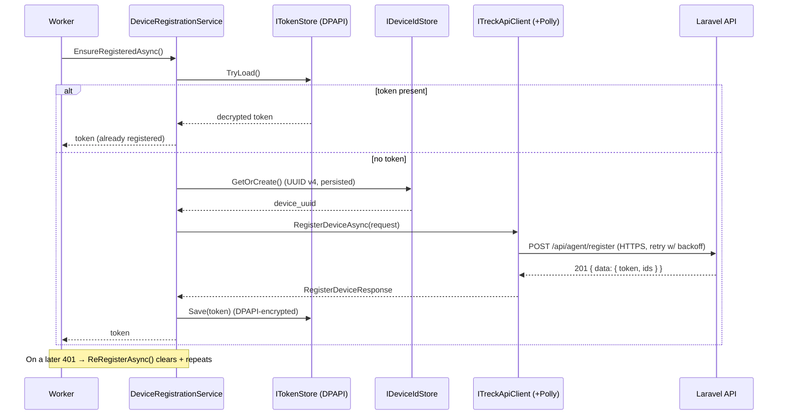
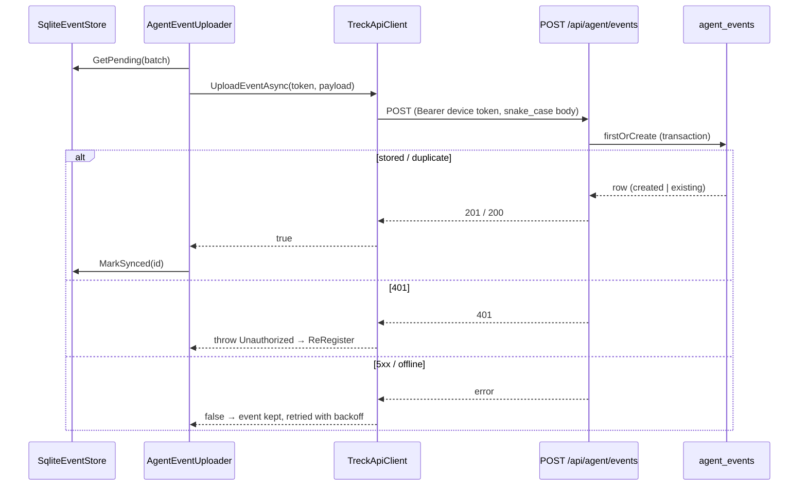

# 24. Windows Agent — Milestone Build

The desktop agent (`agent/`) is built incrementally as a **.NET 8 Worker
Service**. Each milestone is self-contained and testable before the next
begins. This supersedes the earlier all-at-once reference sketch (the design
rationale in [doc 17](17-windows-agent.md) still applies).

## Milestone roadmap

| # | Scope | Requirements | Status |
| - | ----- | ------------ | ------ |
| **M1** | Skeleton, configuration, structured logging, service lifecycle | 9, 10 | ✅ Complete |
| **M2** | API client + device registration + token storage | 1, 2, 3, 4, 5, 6, 7, 8, 12, 13, 14 | ✅ Complete |
| **M3** | Windows session detection (logon/logoff/lock/unlock/shutdown) | — | ✅ Complete |
| **M4** | Idle-time calculation (Win32) + 60s heartbeat | 5, 6 | ✅ Complete |
| **M5** | Reconnect on network failure + SQLite offline cache | 7, 8 | ✅ Complete |
| **M6** | Windows Service packaging, production runtime & server-side `/api/agent/events` | — | ✅ Complete |

---

## M1 — Skeleton, configuration & structured logging ✅

### Architecture

- **Generic Host + Worker Service.** `Program.cs` builds a
  `HostApplicationBuilder`, registers the app as a Windows Service
  (`AddWindowsService`), and hosts a single `BackgroundService` (`Worker`). The
  same binary runs as a console app in development and as a service in
  production.
- **Configuration.** `AgentOptions` is bound from the `Agent` section of
  `appsettings.json` and **validated at startup** (`ValidateDataAnnotations` +
  `ValidateOnStart`) — the process refuses to start on invalid config
  (fail-fast), which is far safer than discovering a bad URL mid-run.
- **Structured logging.** Serilog is configured from the `Serilog` section:
  a human-readable **console** sink and a rolling **compact-JSON** file sink
  (`logs/treck-agent-<date>.jsonl`, 14-day retention). A bootstrap logger
  captures failures that occur before the host is built. All logs carry
  `MachineName`; later milestones add correlation properties (session id, etc.).
- **Lifecycle.** `Worker` logs a startup banner, then ticks on a
  `PeriodicTimer` at `HeartbeatIntervalSeconds`, and logs a clean stop on
  cancellation. No API/idle/session logic yet — that is deliberately deferred.

### Folder structure

```
agent/
├── Treck.Agent.csproj
├── Program.cs
├── Worker.cs
├── Configuration/AgentOptions.cs
├── appsettings.json
├── appsettings.Development.json
└── .gitignore
```

### How to test

1. **Build:** `cd agent && dotnet restore && dotnet build` — succeeds with no
   warnings (`TreatWarningsAsErrors` is on).
2. **Run:** `dotnet run` — expect a structured startup banner naming the server,
   employee code, and intervals, then a `Debug` "alive tick" each interval.
   (Set `DOTNET_ENVIRONMENT=Development` to see Debug ticks; production level is
   Information.)
3. **Logging:** confirm `agent/logs/treck-agent-<date>.jsonl` is created and each
   line is valid JSON.
4. **Config validation (fail-fast):** blank out `Agent:BaseUrl` in
   `appsettings.json` and run — startup should throw an
   `OptionsValidationException` and exit non-zero.
5. **Config override:** `Agent__HeartbeatIntervalSeconds=10 dotnet run` (env var)
   → ticks every 10s, proving configuration binding.
6. **Graceful shutdown:** Ctrl+C → a single "Treck Agent stopped." line, exit 0.

### Definition of done

Service boots, validates config, emits structured console + JSON-file logs, and
ticks on schedule; invalid config fails fast. ✅

---

---

## M2 — Device registration & API communication ✅

### Architecture

SOLID layering — every collaborator is an interface, wired by DI, so each is
unit-testable in isolation:

- **Api/** — `ITreckApiClient` / `TreckApiClient`: a **typed HttpClient**
  registered through `IHttpClientFactory`, with a **Polly** retry policy
  (exponential backoff on 5xx/408/429/network errors) and a `SocketsHttpHandler`
  that keeps **default TLS certificate validation** and requires TLS 1.2/1.3.
  Single responsibility: (de)serialize snake_case JSON and map the envelope.
  `ApiException`/`UnauthorizedApiException` model failures (req 13).
- **Security/** — `ITokenProtector` / `DpapiTokenProtector`: encrypts the token
  with **Windows DPAPI** (`ProtectedData`, LocalMachine scope + entropy). Only
  ciphertext is written (reqs 8, 9).
- **Storage/** — `IStoragePathProvider` (base dir), `IDeviceIdStore` /
  `FileDeviceIdStore` (persistent **UUID v4**, reqs 4, 5), `ITokenStore` /
  `DpapiTokenStore` (encrypted token file; decrypt-on-load, req 10).
- **Services/** — `IDeviceRegistrationService` / `DeviceRegistrationService`:
  orchestrates id + API + token store. `EnsureRegisteredAsync` returns the
  stored token if present, else registers (reqs 6, 7); `ReRegisterAsync` clears
  and re-registers on an invalid token (req 11). Structured logs on every
  attempt, never logging the key or token (req 14).
- **Models/** — typed request/response DTOs + `ApiEnvelope<T>` (req 12).

The token is resolved by the Laravel side from the device's registration
(SEC-1), so the agent never sends an employee id.

### Folder structure

```
agent/
├── Treck.Agent.sln                  # solution: Treck.Agent + Treck.Agent.Tests
├── Treck.Agent.csproj               # excludes tests/** from its compile items
├── Program.cs                       # DI, IHttpClientFactory, Polly, TLS handler
├── Worker.cs                        # ensures registration on start (retries per tick)
├── Api/
│   ├── ITreckApiClient.cs
│   ├── TreckApiClient.cs
│   └── ApiException.cs
├── Configuration/AgentOptions.cs
├── Models/
│   ├── ApiEnvelope.cs
│   ├── RegisterDeviceRequest.cs
│   └── RegisterDeviceResponse.cs
├── Security/
│   ├── ITokenProtector.cs
│   └── DpapiTokenProtector.cs
├── Services/
│   ├── IDeviceRegistrationService.cs
│   └── DeviceRegistrationService.cs
├── Storage/
│   ├── IStoragePathProvider.cs / StoragePathProvider.cs
│   ├── IDeviceIdStore.cs / FileDeviceIdStore.cs
│   └── ITokenStore.cs / DpapiTokenStore.cs
└── tests/Treck.Agent.Tests/         # xUnit + Moq + coverlet.collector
    ├── Treck.Agent.Tests.csproj     # ProjectReference → ../../Treck.Agent.csproj
    └── *Tests.cs
```

**Build system.** The test project is nested under `agent/`, so the main
`Treck.Agent.csproj` sets `DefaultItemExcludes` to skip `tests/**` — it never
compiles test files or takes a dependency on test packages. `Treck.Agent.sln`
ties both projects together for `dotnet build` / `dotnet test`.

### Registration sequence



### How to test

1. **Build + unit tests:** `cd agent && dotnet test` — runs the xUnit suite
   (DPAPI round-trip [Windows], device-id persistence, registration client
   request/response + error mapping, registration-service orchestration).
2. **Live registration (happy path):** with the Laravel API running and
   `TRECK_AGENT_PROVISIONING_KEY` + a valid `EmployeeCode` set, `dotnet run` →
   logs "Registering device …" then "Device registered: computerId=…". Confirm
   `%ProgramData%\TreckAgent\device.id` (plaintext UUID) and `token.dat`
   (unreadable ciphertext, **not** the bearer token) exist.
3. **Decrypt-on-startup:** stop and re-run → logs "Device already registered;
   using stored token." (no second API call).
4. **Retry/backoff:** point `BaseUrl` at an unreachable host → observe
   "HTTP retry 1/…", "2/…" with doubling delays, then a graceful warning; the
   service keeps running and retries each interval.
5. **Bad provisioning key:** wrong key → API 403 → `ApiException` logged, agent
   stays up and retries.

### Unit tests (delivered)

`agent/tests/Treck.Agent.Tests/`: `DpapiTokenProtectorTests`,
`FileDeviceIdStoreTests`, `TreckApiClientTests`, `DeviceRegistrationServiceTests`.

### Definition of done

Device generates + persists a UUID, registers over validated HTTPS with retry,
stores the token DPAPI-encrypted, decrypts it on restart, and re-registers on
invalidation — all interface-driven and unit-tested. ✅

---

---

## M3 — Windows session detection ✅

### Architecture

Event-driven, no polling, split into a testable core + native adapter:

- **`ISessionMonitor`** — `Start()` / `Stop()` and a `SessionChanged` event;
  the internal publisher (no API involvement).
- **`SessionMonitorBase`** — platform-agnostic core: thread-safe start/stop
  (lock-guarded), **duplicate suppression** (drops consecutive identical events
  within `DuplicateSuppressionMilliseconds`, via an injected `TimeProvider`),
  structured logging, and event raising **outside the lock** (no handler
  reentrancy/deadlock). This is what the unit tests exercise.
- **`WindowsSessionMonitor : SessionMonitorBase`** — native adapter using
  `Microsoft.Win32.SystemEvents` (a managed wrapper over WM_WTSSESSION_CHANGE /
  WM_ENDSESSION). Maps `SessionSwitch`→ Logon/Logoff/Lock/Unlock and
  `SessionEnding`→ Logoff/Shutdown, then calls `Publish`. `[SupportedOSPlatform("windows")]`.
- **`SessionEvent`** (`Type`, `TimestampUtc`), **`SessionEventType`** (Unknown,
  Logon, Logoff, Lock, Unlock, Shutdown, Restart), **`SessionMonitorOptions`**.

The `Worker` starts the monitor and subscribes, logging each event — **it does
not call the API** (that begins in M4).

Two honest limitations, documented in code:
- **Restart vs. shutdown** isn't reliably distinguishable through this API; a
  system-ending notification surfaces as `Shutdown`. `Restart` stays in the enum
  for when a lower-level hook is added.
- `SystemEvents` delivers to the interactive desktop session, so the monitor is
  intended for the per-user session context (helper) per doc 17; a pure
  session-0 service would hook `ServiceBase.OnSessionChange` instead — the
  `SessionMonitorBase` contract is unchanged.

### Folders added

```
agent/Sessions/
├── ISessionMonitor.cs
├── SessionMonitorBase.cs        # thread-safe dedup + publish (testable)
├── WindowsSessionMonitor.cs     # SystemEvents adapter (Windows-only)
├── SessionEvent.cs
├── SessionEventType.cs
└── SessionMonitorOptions.cs
```

### Sequence

```mermaid
sequenceDiagram
    participant OS as Windows (SystemEvents)
    participant M as WindowsSessionMonitor
    participant B as SessionMonitorBase
    participant W as Worker

    W->>M: Start()  (subscribe SessionSwitch/SessionEnding)
    Note over OS: user locks the workstation
    OS-->>M: SessionSwitch(SessionLock)
    M->>B: Publish(Lock)
    B->>B: dedup check (lock + TimeProvider)
    B-->>W: SessionChanged(Lock)  (logged; no API)
    Note over OS: duplicate lock within window
    OS-->>M: SessionSwitch(SessionLock)
    M->>B: Publish(Lock)
    B->>B: within suppression window → dropped
```

### How to test

- **Unit (`dotnet test`)** — `SessionMonitorTests` covers: event raised with
  correct type/timestamp; duplicate same-type suppressed within the window;
  different types allowed; same type allowed after the window elapses (time
  advanced via a mutable `TimeProvider`); zero-window never suppresses.
- **Manual (Windows, `dotnet run`)** — lock (Win+L) / unlock, sign out, and shut
  down; observe structured `Session event: Lock/Unlock/Logoff/Shutdown …` log
  lines. Rapidly locking twice should log one Lock (dedup).

### Definition of done

Session transitions are detected via native notifications (no polling),
de-duplicated, thread-safe, structured-logged, and published internally; core
logic unit-tested. No API calls. ✅

---

---

## M4 — Idle detection & heartbeat ✅

### Architecture

Idle detection and heartbeat scheduling are fully separate from API
communication (the heartbeat path has no reference to `ITreckApiClient` or the
registration service):

- **`IIdleDetector` / `WindowsIdleDetector`** — Win32 `GetLastInputInfo` only;
  returns the idle `TimeSpan`. `[SupportedOSPlatform("windows")]`.
- **`HeartbeatCalculator`** (pure, static) — given `elapsed`, observed
  `idleTime`, and the configured threshold, classifies the interval into
  active vs. idle seconds. No I/O → fully unit-tested.
- **`HeartbeatEvent`** — the internal model (timestamp, elapsed, observed idle,
  `IsIdle`, active/idle seconds). Not sent anywhere in M4.
- **`IHeartbeatScheduler` / `HeartbeatScheduler`** — owns a `PeriodicTimer`
  (constructed with the injected `TimeProvider` for testable timing) at
  `HeartbeatIntervalSeconds` (default 60). Each tick reads the idle detector,
  builds a `HeartbeatEvent`, logs it, and raises `HeartbeatProduced`. The
  per-tick logic is factored into `CaptureHeartbeat()` (public) so it can be
  unit-tested without real time.

The idle **threshold** and heartbeat **interval** come from `AgentOptions`
(`IdleThresholdSeconds`, `HeartbeatIntervalSeconds`) — both configurable. The
`Worker` starts the scheduler alongside the session monitor and logs each
heartbeat; it does **not** send anything.

### Folders added

```
agent/Activity/
├── IIdleDetector.cs
├── WindowsIdleDetector.cs        # GetLastInputInfo (Windows-only)
├── HeartbeatEvent.cs             # internal event model
├── HeartbeatCalculator.cs        # pure active/idle classification (testable)
├── IHeartbeatScheduler.cs
└── HeartbeatScheduler.cs         # 60s PeriodicTimer → HeartbeatProduced
```

### Sequence

```mermaid
sequenceDiagram
    participant T as PeriodicTimer (60s)
    participant S as HeartbeatScheduler
    participant I as WindowsIdleDetector
    participant W as Worker

    W->>S: Start()
    loop every 60s
        T-->>S: tick
        S->>I: GetIdleTime()
        I-->>S: idle TimeSpan (GetLastInputInfo)
        S->>S: HeartbeatCalculator.Create(elapsed, idle, threshold)
        S-->>W: HeartbeatProduced(active/idle seconds)  (logged; no API)
    end
```

### How to test

- **Unit (`dotnet test`)** — `HeartbeatCalculatorTests` (active below threshold,
  idle at/above threshold, boundary counts as idle, negative elapsed clamped) and
  `HeartbeatSchedulerTests` (active vs. idle event raised via a mocked
  `IIdleDetector`; elapsed measured between captures using a mutable
  `TimeProvider`).
- **Manual (Windows, `dotnet run`)** — with `HeartbeatIntervalSeconds` lowered
  (e.g. 10) and `IdleThresholdSeconds` small (e.g. 15): type/move the mouse →
  `Heartbeat: active=…s idle=0s isIdle=False`; stop touching input past the
  threshold → `isIdle=True idle=…s`.

### Definition of done

Idle time is read from a native API, the interval is classified against a
configurable threshold, a 60-second scheduler publishes internal heartbeat
events (no polling of the API, no API calls at all), and the calculation +
scheduler are unit-tested. No screenshots, no application tracking. ✅

---

---

## M5 — Offline queue & sync ✅

### Architecture

Storage and API communication are deliberately isolated:

- **`IOfflineEventStore` / `SqliteEventStore`** — durable, ordered queue in
  `offline.db`. Pure persistence (no API references). Enqueue (dedup by unique
  idempotency key), ordered `GetPending`, `MarkSynced`, `RecordFailure`,
  `Prune`. Thread-safe (lock over a single connection); survives restarts.
- **`IEventUploader` / `AgentEventUploader`** — the *only* API touchpoint on the
  sync path. Gets the device token from the registration service and POSTs one
  event; re-registers on 401.
- **`ISyncService` / `SyncService`** — one pass: pull an ordered batch, upload
  each, **mark synced only on ack**, stop at the first failure (preserving
  order), then prune. Composes the store + uploader; touches neither directly.
- **`SyncWorker`** — hosted loop running every `SyncIntervalSeconds`, with
  **exponential backoff** up to `MaxBackoffSeconds` when a cycle makes no
  progress, resetting on success.

Producers changed: the `Worker` now **enqueues** heartbeat (M4) and session (M3)
events into the store instead of logging — so nothing is lost during a network
interruption; the `SyncWorker` drains the queue independently.

Requirement mapping: SQLite ✅(1) · stores heartbeat/session ✅(2) · ordering by
autoincrement id ✅(3) · dedup via unique idempotency key ✅(4) · mark synced
only after ack ✅(5) · exponential backoff ✅(6) · restart-safe (durable file)
✅(7) · `MaxRows` size cap ✅(8) · retention cleanup of synced rows ✅(9) · no
loss during outages (bounded by the cap) ✅(10).

### Folders added

```
agent/Offline/
├── OfflineEvent.cs            # queued event + kind
├── OfflineStoreOptions.cs     # interval/backoff/batch/maxRows/retention
├── IOfflineEventStore.cs
└── SqliteEventStore.cs        # Microsoft.Data.Sqlite; ordered, dedup, capped
agent/Sync/
├── IEventUploader.cs          # API seam (isolated from storage)
├── AgentEventUploader.cs      # device-token upload + 401 re-register
├── ISyncService.cs            # SyncResult
├── SyncService.cs             # pull → upload → mark/keep → prune
└── SyncWorker.cs              # hosted loop + exponential backoff
```

### Sequence

```mermaid
sequenceDiagram
    participant P as Producers (heartbeat/session)
    participant St as SqliteEventStore
    participant SW as SyncWorker
    participant Sv as SyncService
    participant U as AgentEventUploader → API

    P->>St: Enqueue(event)   (durable, ordered, dedup)
    loop every SyncIntervalSeconds (backoff on failure)
        SW->>Sv: SyncPendingAsync()
        Sv->>St: GetPending(batch)
        Sv->>U: TryUploadAsync(event)
        alt acknowledged
            U-->>Sv: true
            Sv->>St: MarkSynced(id)
        else failure / offline
            U-->>Sv: false / throws
            Sv->>St: RecordFailure(id)  (kept; retried later)
        end
        Sv->>St: Prune (retention + max-size cap)
    end
```

### How to test

- **Unit (`dotnet test`)** — `OfflineStoreTests`: save; retrieve pending in
  order; duplicate idempotency key ignored; `MarkSynced` clears pending;
  `RecordFailure` keeps + counts attempts; **restart recovery** (new store
  instance over the same file sees the rows). `SyncServiceTests`: successful sync
  marks all; failed sync keeps everything; stops at first failure preserving
  order; empty queue is a no-op (uses a fake uploader).
- **Manual (Windows, `dotnet run`)** — point `BaseUrl` at an unreachable host:
  heartbeats accumulate in `%ProgramData%\TreckAgent\offline.db` and the sync
  worker logs backing-off cycles; restore connectivity (once the M6 server
  endpoint exists) and the queue drains.

### Note on the upload endpoint

`AgentEventUploader` POSTs to `POST /api/agent/events` — the **server-side
ingestion endpoint is delivered in M6** (see the M6 section below). At M5 the
endpoint did not yet exist, so uploads simply failed and events remained safely
queued, which is exactly the resilience this milestone provides. The store/sync
logic is fully unit-tested independent of the server.

### Definition of done

Events are persisted to SQLite, ordered, de-duplicated, retained until acked,
size-capped, and survive restarts; the sync worker retries with exponential
backoff; storage stays isolated from the API. Unit-tested. ✅

---

## M6 — Windows Service packaging & production runtime integration ✅

Packages the agent as a production Windows Service and closes the ingestion loop
so the M5 offline queue drains end-to-end. No previous milestone is redesigned;
the existing SOLID seams (`IEventUploader`, `ITreckApiClient`, `IOfflineEventStore`)
are unchanged.

### Architecture

**Client (`agent/`)**

- **Windows Service hosting.** `Program.cs` keeps
  `AddWindowsService(o => o.ServiceName = "TreckAgent")` and adds a graceful
  `HostOptions.ShutdownTimeout` (30s) so `Worker` and `SyncWorker` observe the
  stop signal and finish a final cycle. `AddWindowsService` is a no-op off the
  SCM, so `dotnet run` (console/dev) is unchanged. Cancellation is already
  cooperative: both hosted services loop on the `stoppingToken` and exit cleanly
  on `OperationCanceledException`.
- **Service-mode logging.** Under the SCM the process CWD is `System32`, so the
  relative Serilog file path would be unwritable. `Program.cs` detects
  `WindowsServiceHelpers.IsWindowsService()` and redirects the file sink to
  `%ProgramData%\TreckAgent\logs` (writable by `LocalSystem`), pre-created by the
  installer. Console/dev keeps the relative `logs/` path.
- **Production configuration.** `appsettings.Production.json` (git-ignored) layers
  over `appsettings.json` when `DOTNET_ENVIRONMENT=Production` (set by the
  installer in the service registry). Only the `.example` template is committed —
  **no secrets in source control**. Required settings are still validated at
  startup (`ValidateDataAnnotations().ValidateOnStart()` on `AgentOptions`).
- **Sync completion.** `AgentEventUploader` already POSTs to `/api/agent/events`,
  treats any 2xx as an acknowledgement (only then is the event dropped), keeps
  non-acked events in SQLite, and re-registers on 401 — **no change required**
  beyond documenting it and adding upload tests.

**Server (Laravel)**

- **`POST /api/agent/events`** — device-token authenticated (`ability:agent:report`,
  `throttle:agent`). `EventIngestionController` → `AgentEventIngestionService`
  persists one event inside a **DB transaction** via
  `firstOrCreate((computer_id, idempotency_key), …)`, returning **201** on first
  store and **200** on an idempotent duplicate (both 2xx = ack). A concurrent
  duplicate that trips the unique index is caught and resolved to the stored row.
- **Identity binding (SEC-1).** The owning employee is taken from the resolved
  `Computer`, never the request body.
- **Storage.** `agent_events` keeps the event verbatim (`payload` JSON, plus
  `occurred_at`/`received_at`) for later projection; a unique
  `(computer_id, idempotency_key)` index enforces idempotency.

### Folders / files added

```
agent/
├── deploy/
│   ├── publish.ps1                 # win-x64 publish (framework-dependent default; -SelfContained opt-in)
│   ├── install-service.ps1         # register + start (Automatic startup, recovery)
│   ├── uninstall-service.ps1       # stop + remove (data preserved unless -PurgeData)
│   └── README.md                   # deployment quick reference
├── appsettings.Production.json.example   # committed template (no secrets)
├── Program.cs                      # + ShutdownTimeout, service-mode log path
└── .gitignore                      # ignores appsettings.Production.json, publish/

app/
├── Enums/AgentEventKind.php
├── Models/AgentEvent.php
├── Http/Requests/Agent/StoreAgentEventRequest.php
├── Http/Controllers/Api/Agent/EventIngestionController.php
└── Services/Agent/AgentEventIngestionService.php
database/
├── migrations/2026_07_16_000001_create_agent_events_table.php
└── factories/AgentEventFactory.php
routes/modules/agent.php            # + POST agent/events
tests/Feature/Agent/EventIngestionTest.php
agent/tests/Treck.Agent.Tests/TreckApiClientTests.cs   # + UploadEventAsync tests
```

### Sequence (queue drain, end-to-end)



### How to test

- **.NET (`dotnet restore && dotnet build && dotnet test`, on Windows):** M6 adds
  `TreckApiClientTests.UploadEventAsync_*` — endpoint path, Bearer header,
  snake_case body, 201/200 = ack, 401 throws, 5xx returns false (kept queued).
- **Laravel (`php artisan test`):** `EventIngestionTest` — heartbeat + session
  storage, identity binding, idempotent duplicate (200, single row), per-device
  key isolation, auth/ability gates, and validation (`kind`, missing fields,
  non-JSON `payload`).
- **Manual E2E:** install the service; confirm logs; generate heartbeat/session
  events; drop the network and watch the SQLite queue grow; restore and confirm
  the queue drains and `AgentEvent::count()` rises. Full runbook in §24.6 below.

### Definition of done

Agent runs as an auto-start Windows Service with clean start/stop and
service-safe logging; production config is environment-specific with no secrets
in git and validated at startup; the server exposes an authenticated, idempotent,
transactional `/api/agent/events`; the offline queue drains end-to-end. Client
upload path unit-tested; server ingestion feature-tested. ✅

---

## 24.x Deployment & verification runbook

### Service identity

| Property | Value |
| -------- | ----- |
| Service name (SCM key) | `TreckAgent` (matches `Program.cs`) |
| Display name | `Treck Agent` |
| Description | Treck employee productivity & PC activity monitoring agent… |
| Startup | Automatic · Log-on: `LocalSystem` · Recovery: restart 5s/10s/30s |

### Deployment model & runtime

The project is **RID-agnostic**. Development (`dotnet restore` / `build` / `test`
/ `run`) and the **default framework-dependent publish are RID-less**, so they use
the installed shared runtime and download **no** win-x64 runtime packs — which
matters on locked-down/slow networks. (Do not add `<RuntimeIdentifier(s)>` to the
csproj: it forces RID restore into every `dotnet restore` and pulls the runtime
pack even for framework-dependent dev.)

Each **target machine needs the .NET 8 Desktop Runtime (x64)** installed:

```powershell
winget install Microsoft.DotNet.DesktopRuntime.8   # or download from dotnet.microsoft.com
```

The **Desktop** runtime (not just the base runtime) is required because session
detection uses `Microsoft.Win32.SystemEvents`, which lives in the Windows Desktop
shared framework — the same reason a *self-contained* build must download the
`Microsoft.WindowsDesktop.App.Runtime.win-x64` pack. Self-contained is an optional
release build (`-SelfContained`) for air-gapped targets with no runtime; it is the
only build that pins `-r win-x64`, so build it on a host with connectivity.

### Build & install (target machine, elevated PowerShell)

```powershell
cd agent\deploy
Copy-Item ..\appsettings.Production.json.example ..\appsettings.Production.json
notepad ..\appsettings.Production.json      # BaseUrl, ProvisioningKey, EmployeeCode
./install-service.ps1 -Publish              # framework-dependent (RID-less) publish + install + start
# ./install-service.ps1 -Publish -SelfContained   # optional release: bundle the runtime
```

Plain `dotnet` equivalents:

```powershell
# Development / default publish — RID-less, framework-dependent, no downloads:
dotnet restore agent\Treck.Agent.csproj
dotnet publish agent\Treck.Agent.csproj -c Release -o agent\publish

# Optional self-contained release — pins the RID; downloads ~130 MB of runtime packs:
dotnet publish agent\Treck.Agent.csproj -c Release -r win-x64 --self-contained true -o agent\publish
```

### §24.6 Manual end-to-end verification

1. **Install & start** — `./install-service.ps1 -Publish`; `Get-Service TreckAgent`
   (Running); `sc.exe qc TreckAgent` (START_TYPE = AUTO_START).
2. **Confirm logs** —
   `Get-Content "$env:ProgramData\TreckAgent\logs\treck-agent-*.jsonl" -Tail 20 -Wait`
   → startup banner, registration, periodic heartbeats.
3. **Generate events** — lock/unlock/sign-out (session events); wait a few
   heartbeat intervals. Server: `php artisan tinker --execute="echo App\Models\AgentEvent::count();"`.
4. **Stop the network** — offline queue (`%ProgramData%\TreckAgent\offline\*.db`)
   grows; logs show ret/backoff. Nothing lost.
5. **Restore the network** — within a sync interval logs show
   `Sync cycle: uploaded=N …` and `AgentEvent::count()` rises to match.
6. **Lifecycle** — `Stop-Service TreckAgent` (graceful stop, no crash) then
   `Start-Service TreckAgent`.

### Uninstall

```powershell
./uninstall-service.ps1              # remove service + binaries; keep identity/queue
./uninstall-service.ps1 -PurgeData  # also wipe %ProgramData%\TreckAgent
```

### Limitations & follow-ups

- `agent_events` is a raw landing table; projecting events into
  attendance/activity aggregates is a later milestone.
- No server-side retention job for `agent_events` yet (agent prunes its local
  queue).
- Install scripts target `win-x64`; add `win-arm64` if required.
- Service runs as `LocalSystem`; a least-privileged account is a hardening
  follow-up (grant write on `%ProgramData%\TreckAgent`).

---

*M6 complete.*

---

## Phase 6 note - Real-Time Presence (no agent change)

Phase 6 adds a real-time presence dashboard built entirely **server-side** on
top of the events this agent already uploads via `POST /api/agent/events`. The
Windows agent is **unchanged**: its existing heartbeat (`IsIdle`) and session
(`Lock`/`Unlock`/`Logon`/`Logoff`) events are projected into a materialized
`computer_presence` table and broadcast to the admin dashboard.

One compatibility detail worth recording: the agent serializes `SessionEvent.Type`
with the default `System.Text.Json` settings, i.e. as the **numeric ordinal** of
the C# `SessionEventType` enum (Unknown=0, Logon=1, Logoff=2, Lock=3, Unlock=4,
Shutdown=5, Restart=6). The server's `PresenceProjector` accepts both that numeric
form and the string name, so no agent change was needed. If a future milestone
wants self-describing session payloads, adding a `JsonStringEnumConverter` to the
agent's serializer is the minimal change - but it is not required for Phase 6.

Full design: [`docs/25-realtime-presence.md`](25-realtime-presence.md).

---

## Phase 7 — Application Usage Tracking ✅ (written; build requires Windows)

The agent now tracks which foreground application is in use and uploads
**completed usage sessions** through the existing offline queue + `/api/agent/events`
pipeline (a new `app_usage` event kind). No new sync infrastructure was added.

> **Build note.** These files target `net8.0-windows` and use Win32 APIs
> (`SetWinEventHook`, `GetForegroundWindow`, …). They compile and run on Windows
> only; this repository's Linux CI environment has no Windows .NET SDK, so the
> Phase 7 agent code is delivered **written and unit-test-designed but not built
> here**. The platform-agnostic state machine (`ApplicationSessionManager`) is
> covered by xUnit tests that run on any OS.

### Architecture

- **`WindowsActiveWindowService`** (`IActiveWindowService`) reads the foreground
  window on demand: `GetForegroundWindow` → `GetWindowThreadProcessId` →
  `GetWindowText`, plus the managed `Process` for the friendly name/executable.
  It reads window/process **identity only** and sanitizes the title.
- **`WindowsApplicationTracker`** (`IApplicationTracker`) installs two
  `SetWinEventHook` hooks — `EVENT_SYSTEM_FOREGROUND` and `EVENT_OBJECT_NAMECHANGE`
  — on a dedicated message-pump thread. Both fire the instant focus or the window
  title changes, so there is **no polling** and idle CPU is negligible. Each
  notification raises `ApplicationChanged`.
- **`ApplicationSessionManager`** (`IApplicationSessionManager`) is the
  platform-agnostic state machine. It keeps at most one open session and turns
  the change stream into completed sessions: a different process **or** a
  different window title closes the open session and opens a new one; a null or
  ignored app closes the open session and opens nothing.
- **`Worker`** wires them together: `ApplicationChanged → Track(...)`,
  `SessionCompleted → enqueue(app_usage)`. A `Lock`/`Logoff`/`Shutdown` session
  event (and agent stop) **flushes** the open session so nothing is lost.

Configurable ignore rules (`ApplicationTracking` section) exclude shell/system
surfaces (`explorer.exe`, `SearchHost.exe`, `LockApp.exe`,
`ShellExperienceHost.exe`, `System`, `Idle`, …). A minimum-duration filter drops
rapid Alt-Tab flicker.

### Folders added

```
agent/Applications/
├── ApplicationInfo.cs               # foreground snapshot (metadata only)
├── ApplicationChangedEventArgs.cs   # Events/ApplicationChanged
├── ApplicationUsageEvent.cs         # completed session (uploaded payload)
├── IActiveWindowService.cs
├── WindowsActiveWindowService.cs    # Win32 foreground reader
├── IApplicationTracker.cs
├── WindowsApplicationTracker.cs     # WinEvent hooks + message pump (no polling)
├── IApplicationSessionManager.cs
├── ApplicationSessionManager.cs     # session state machine (unit-tested)
└── ApplicationTrackingOptions.cs    # ignore rules, minimums, limits
agent/tests/Treck.Agent.Tests/
└── ApplicationSessionManagerTests.cs
```

Also modified: `Offline/OfflineEvent.cs` (adds `OfflineEventKind.AppUsage`),
`Sync/AgentEventUploader.cs` (maps `AppUsage → "app_usage"`), `Worker.cs`,
`Program.cs` (DI + options), `appsettings.json`.

### Session lifecycle (state machine)

```
                  foreground change / title change
   ┌─────────┐   ───────────────────────────────▶   ┌──────────────┐
   │  none   │                                       │ open session │
   └─────────┘   ◀───────────────────────────────   └──────────────┘
        ▲          null / ignored app / flush            │
        │            (emit completed session)            │ same app+title
        └────────────────────────────────────────────────┘  (no-op)
```

Only a **completed** session is emitted (and only if it meets the minimum
duration); the currently-open session is never transmitted.

### How to test (on Windows)

1. Run the agent as a console app; switch between a few applications and browser
   tabs. Logs show `App session: <process> "<title>" for <n>s.` each time you
   move on.
2. Server: `php artisan tinker --execute="echo App\Models\ApplicationUsage::whereNotNull('session_id')->count();"`
   rises as sessions arrive.
3. Go offline, keep switching apps, come back — sessions queue locally and drain
   with the next sync cycle; none are lost.
4. `dotnet test agent/tests` runs `ApplicationSessionManagerTests` (OS-agnostic).

### Definition of done

- Event-driven detection (WinEvent hooks), **no busy polling**.
- Completed **sessions** only; window-title change starts a new session.
- Reuses the offline queue + `/api/agent/events`; idempotent per session.
- Configurable ignore rules; privacy-preserving (metadata only).
- Session state machine unit-tested.

Full design: [`docs/26-application-usage.md`](26-application-usage.md).

---

## Phase 8 — Screenshot Module ✅ (written; build requires Windows)

The agent captures the interactive desktop on an admin-defined policy and uploads
**completed captures** through the existing offline queue + sync pipeline. It is
opt-in (disabled by default) and never blocks the other loops.

> **Build note.** These files target `net8.0-windows` and use Win32
> (`EnumDisplayMonitors`, `OpenInputDesktop`, GDI `CopyFromScreen`) plus
> `System.Drawing.Common` for encoding — Windows only. The Linux CI here has no
> Windows .NET SDK, so the Phase 8 agent code is delivered **written and
> unit-test-designed but not built here**. The sync step
> (`ScreenshotSyncServiceTests`) is OS-agnostic and runs anywhere.

### Architecture

- **`WindowsScreenshotCaptureService`** — enumerates monitors, captures each with
  GDI at native resolution (per-monitor-v2 DPI aware). `CanCapture()` returns
  false unless the input desktop is "Default", so the secure/lock/login desktop
  is never captured.
- **`ScreenshotProcessingService`** — compresses to JPEG (quality) or PNG,
  SHA-256 hashes, drops frames identical to the previous one per monitor, writes a
  temp file under `%ProgramData%\TreckAgent\screenshots`.
- **`ScreenshotWorker`** (hosted, **interactive session**) — its own cadence (fixed
  or jittered); evaluates policy (enabled, interactive desktop, active user, not
  ignored) then captures → processes → hands each survivor to an `IScreenshotSink`.
- **`ScreenshotSyncService`** — invoked by `AgentEventUploader` for `Screenshot`
  events: reads the temp file, POSTs it multipart to `/api/agent/screenshots`, and
  deletes the temp file on success. The `SyncWorker` drain, ordering and backoff
  are unchanged.

**Session-0 isolation (important).** A Windows service runs in session 0 and
cannot see the user's desktop. This affects **all** desktop-bound collection —
screenshots (Phase 8), foreground/app-usage (Phase 7) and idle detection (Phase
4) — so every one of them runs in an **interactive capture helper**:

- **Service (session 0):** `ScreenshotHelperSupervisor` launches
  `TreckAgent.exe --capture-helper` into the active console session via
  `WTSQueryUserToken` + `CreateProcessAsUser` (`WindowsInteractiveSessionLauncher`),
  logging session/user/pid, and relaunches on crash / log-off→on /
  fast-user-switch. `AgentEventSpoolWorker` ingests the helper's spool sidecars
  (screenshot / app_usage / heartbeat) into the offline queue — the service stays
  the single DB writer. The supervisor grants the interactive user Modify on only
  the `helper` directory. The service's `Worker` keeps registration + session
  monitor + sync but no longer collects heartbeat/foreground
  (`AgentRuntime.CollectInteractiveInProcess = false`).
- **Helper (interactive session):** `ScreenshotWorker` (screenshots),
  `ApplicationUsageSpoolForwarder` (Phase 7 foreground) and `HeartbeatSpoolForwarder`
  (Phase 4 idle/heartbeat), all emitting to `FileAgentEventSpool`. No
  registration/sync.
- **Console/dev:** already interactive, so the `Worker` collects heartbeat +
  app-usage in-process and `ScreenshotWorker` uses `OfflineQueueScreenshotSink`.

`Program.cs` picks the topology automatically (`--capture-helper` /
`--capture-helper-test` args, `WindowsServiceHelpers.IsWindowsService()`).
`--capture-helper-test` runs a one-shot capture validation and exits.

### Folders added

```
agent/Screenshots/
├── ScreenshotOptions.cs               # policy config
├── ScreenshotMetadata.cs              # queued payload (metadata + temp path)
├── MonitorCapture.cs                  # per-monitor bitmap holder (IDisposable)
├── IScreenshotCaptureService.cs
├── WindowsScreenshotCaptureService.cs # GDI capture; secure-desktop guard; DPI
├── IScreenshotProcessingService.cs
├── ScreenshotProcessingService.cs     # compress + SHA-256 + dedup + temp file
├── IScreenshotSyncService.cs
├── ScreenshotSyncService.cs           # upload + temp-file cleanup
├── ScreenshotWorker.cs                # hosted capture cadence + policy (interactive)
├── IScreenshotSink.cs                 # capture destination abstraction
├── OfflineQueueScreenshotSink.cs      # in-process → offline queue
├── SpoolScreenshotSink.cs             # helper → event spool
├── ScreenshotSelfTest.cs              # --capture-helper-test one-shot validation
├── IInteractiveSessionLauncher.cs
├── WindowsInteractiveSessionLauncher.cs  # WTS + CreateProcessAsUser (+ session/user/pid diag)
└── ScreenshotHelperSupervisor.cs      # service: launch/monitor helper; ACL grant
agent/Spooling/                        # helper → service event bridge (Phase 8 / #4)
├── HelperPaths.cs                     # shared helper dir tree resolver
├── SpooledEvent.cs                    # sidecar DTO ↔ OfflineEvent
├── IAgentEventSpool.cs
├── FileAgentEventSpool.cs             # helper writer + startup write-probe
├── AgentEventSpoolWorker.cs           # service: spool → offline queue (single DB writer)
├── HeartbeatSpoolForwarder.cs         # Phase 4 idle/heartbeat, in the helper
└── ApplicationUsageSpoolForwarder.cs  # Phase 7 foreground, in the helper
agent/Configuration/AgentRuntime.cs    # in-process vs delegated collection flag
agent/tests/Treck.Agent.Tests/
├── ScreenshotSyncServiceTests.cs
└── AgentEventSpoolTests.cs
```

Also modified: `Offline/OfflineEvent.cs` (adds `OfflineEventKind.Screenshot`),
`Api/ITreckApiClient.cs` + `Api/TreckApiClient.cs` (`UploadScreenshotAsync`
multipart), `Sync/AgentEventUploader.cs` (Screenshot branch), `Program.cs`
(DI + options + hosted service), `appsettings.json`, `Treck.Agent.csproj`
(`System.Drawing.Common`).

### How to test

1. On Windows, `Screenshots.Enabled=true`; run the agent and confirm
   `Screenshot queued: …` log lines and rising
   `Screenshot::whereNotNull('image_hash')->count()` on the server.
2. Lock the workstation — nothing is captured.
3. Go offline, keep working, reconnect — queued screenshots drain and temp files
   clear.
4. `dotnet test agent/tests` runs `ScreenshotSyncServiceTests` (OS-agnostic).

### Definition of done

- Native multi-monitor, DPI-correct capture; secure/lock desktop never captured.
- Configurable policy (interval/jitter/active-only/ignore rules); opt-in.
- Compress + SHA-256 + duplicate detection; completed captures only.
- Reuses the offline queue + sync pipeline; temp file deleted after upload.
- Privacy-preserving (image + metadata only; no input/clipboard/file capture).

Full design: [`docs/27-screenshot-module.md`](27-screenshot-module.md).

---

## Phase 9 note — Notifications

Phase 9 adds a server-side notification engine that turns agent signals
(presence, application usage, and agent/system health) into rule-driven in-app
and email alerts for administrators. It is additive and requires no agent build
changes. Full design: [`docs/29-notifications.md`](29-notifications.md).

---

## Phase 11 note — shared computers

The agent reports the logged-in Windows username on every event/upload (via the
existing `EventSource`/`SourceStamp`, now with an explicit `WindowsUsername`
alias). This is additive and backward compatible — no build or deployment change
is required for existing single-user machines. Full design:
[`docs/31-multi-user-computer-and-manager-hierarchy.md`](31-multi-user-computer-and-manager-hierarchy.md).

---

## Phase 12 note — file download monitoring

Phase 12 adds an opt-in `FileDownloadMonitor` (agent/Downloads/) that runs in the
interactive helper and reports file-download **metadata** through the existing
offline queue (a new `file_download` event kind). It is disabled by default and
additive — no build or deployment change is required for existing agents. Full
design: [`docs/32-file-download-monitoring.md`](32-file-download-monitoring.md).
