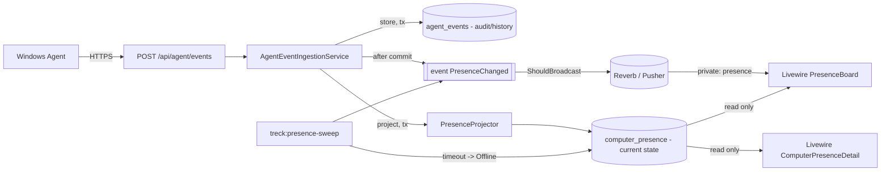
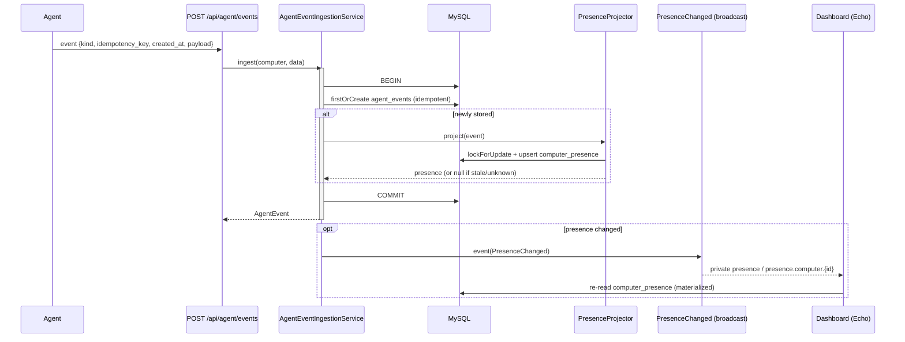
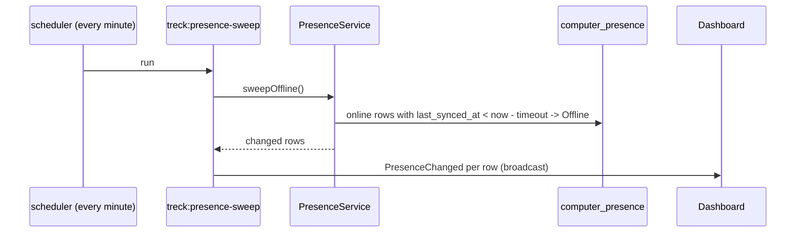

# 25. Real-Time Presence Dashboard (Phase 6)

A production real-time dashboard that shows the live presence of every computer,
projected from the agent events already ingested in M6. It adds a materialized
current-state table, an event-driven projector, admin-only broadcasting, and a
Livewire dashboard that updates with no polling and no page refresh.

The Windows agent is unchanged: presence is built entirely server-side on top of
the existing `agent_events` stream.

---

## 25.1 Architecture



Key properties:

- **Materialized current state.** `computer_presence` holds exactly one row per
  computer. The dashboard reads only this table - it never scans `agent_events`.
  History remains in `agent_events` for audit.
- **Event-driven projection.** `PresenceProjector` advances a single row per
  incoming event inside the ingest transaction. It never recomputes from history.
- **Sweep for absence.** "Missing heartbeat -> Offline" cannot be event-driven
  (there is no event), so `treck:presence-sweep` (scheduled every minute) flips
  quiet rows to Offline and broadcasts.
- **Legacy liveness mirror.** The agent only calls `/register` and `/events` (it
  no longer hits the old `/login`, `/activity`, `/logout` endpoints that used to
  call `Computer::markSeen()`). So on each ingested event the service also mirrors
  the presence onto `computers.status` / `last_seen_at` / `last_activity_at`,
  keeping `DeviceStatusService`, the reconcile sweep, and the M6 dashboard
  accurate. Presence -> ComputerStatus mapping: Active->Online, Idle->Idle,
  Locked->Locked, LoggedOut/Offline->Offline.
- **Thin controllers / SOLID.** `PresenceController` only renders views. Logic
  lives in `PresenceProjector` (write) and `PresenceService` (read + sweep);
  broadcasting is a dedicated event.

### Components

| Layer | Class | Responsibility |
| ----- | ----- | -------------- |
| Enum | `App\Enums\PresenceStatus` | Active / Idle / Locked / Logged Out / Offline |
| Table/Model | `computer_presence` / `App\Models\ComputerPresence` | Materialized current state (1 row per computer) |
| Projector | `App\Services\Presence\PresenceProjector` | Apply one event to the presence row (tx, ordering guard) |
| Read model | `App\Services\Presence\PresenceService` | `summary()`, `rows()`, `sweepOffline()` |
| Event | `App\Events\PresenceChanged` | `ShouldBroadcast` on private `presence` + `presence.computer.{id}` |
| Ingest hook | `App\Services\Agent\AgentEventIngestionService` | store -> project -> mirror liveness onto `computers` -> broadcast (after commit) |
| Sweep | `App\Console\Commands\SweepPresenceOffline` (`treck:presence-sweep`) | timeout -> Offline + broadcast |
| UI | `App\Livewire\Presence\{PresenceBoard,ComputerPresenceDetail}` | Live board + details, Echo listeners |

### Status rules

| Trigger | Presence |
| ------- | -------- |
| Session Lock | Locked |
| Session Unlock | Active |
| Session Logon | Active (session start recorded) |
| Session Logoff / Shutdown / Restart | Logged Out |
| Heartbeat `IsIdle = false` | Active |
| Heartbeat `IsIdle = true` | Idle (records idle seconds) |
| No contact within `presence.offline_timeout_seconds` | Offline (sweep) |

"Online" = Active + Idle + Locked. The projector accepts the session `Type` as a
string ("Lock") or the numeric C# `SessionEventType` ordinal (Lock = 3, ...), so
the agent's default JSON serialization needs no change.

---

## 25.2 Projection & broadcast sequence



Offline transition (no event arrives):



---

## 25.3 Security

- The dashboard routes (`/presence`, `/presence/computers/{id}`) require `auth`,
  `active`, and `role:admin`. Livewire components re-check admin in `mount()`.
- Broadcast channels are **private** and authorized in `routes/channels.php` to
  active administrators only.
- `PresenceChanged::broadcastWith()` sends only display fields (computer name,
  employee, department, status, timestamps, idle seconds). Device tokens,
  provisioning keys, and other credentials are never broadcast or rendered.

---

## 25.4 Performance

- Dashboard queries are O(computers): `summary()` is one `GROUP BY status` over
  `computer_presence`; `rows()` is one indexed load with eager relations.
- Presence is never derived by scanning `agent_events`; that table is
  append-only history/audit.
- `computer_presence` indexes `(status, last_synced_at)` for the sweep and the
  board grouping; one unique row per `computer_id`.

---

## 25.5 Real-time transport (Reverb)

Broadcasting is driver-agnostic. Default `BROADCAST_CONNECTION=log` keeps
everything working with no realtime server (events go to the log). For live
updates:

```bash
composer require laravel/reverb
php artisan reverb:install         # or set config manually (already scaffolded)
npm install                        # pulls laravel-echo + pusher-js (package.json)
npm run build

# .env
BROADCAST_CONNECTION=reverb
REVERB_APP_ID=... REVERB_APP_KEY=... REVERB_APP_SECRET=...
REVERB_HOST=127.0.0.1 REVERB_PORT=8080 REVERB_SCHEME=http

php artisan reverb:start           # websocket server
php artisan queue:work             # if broadcasts are queued
```

`resources/js/echo.js` wires `window.Echo` (Reverb via the Pusher protocol);
Livewire's `echo-private:*` listeners discover it automatically.

---

## 25.6 Deployment notes

- Schedule already includes the sweep (driven by the existing cron entry):
  `Schedule::command('treck:presence-sweep')->everyMinute()`.
- Run `php artisan reverb:start` under a process supervisor (systemd/Supervisor)
  alongside the queue workers.
- Set `presence.offline_timeout_seconds` (`TRECK_PRESENCE_OFFLINE_TIMEOUT`)
  comfortably above the agent heartbeat interval to avoid flapping (default 180).

---

## 25.7 Manual verification

1. Seed data and log in as an admin; open `/presence` (Live Presence in the nav).
2. With Reverb running (`php artisan reverb:start`) and assets built, keep the
   board open in a browser.
3. Send events as a device (reuse the M6 curl / a registered agent):
   - active heartbeat -> row shows **Active**, card counts update live;
   - `{"IsIdle":true}` heartbeat -> **Idle** with idle time;
   - session `Lock` -> **Locked**; `Unlock` -> **Active**; `Logoff` -> **Logged Out**.
   Each change appears without refreshing the page.
4. Stop sending events; within `offline_timeout_seconds` + one sweep tick the row
   flips to **Offline** live.
5. Open a computer's details page and confirm current session duration, last
   sync, idle duration, and recent session/heartbeat lists.
6. Log in as a non-admin and confirm `/presence` returns 403.

Server-side, the same behavior is covered by:

```bash
php artisan test tests/Unit/Presence tests/Feature/Presence
```

---

## 25.8 Limitations & follow-ups

- Live delivery requires Reverb (or another broadcaster) running; with the `log`
  driver the board is correct but only refreshes on navigation/Livewire actions.
- Session `Type` mapping relies on the C# `SessionEventType` ordinals when the
  agent serializes enums as numbers; if the agent later emits string names, both
  are already handled.
- Presence is per-computer. An employee-level roll-up (most-active across their
  machines) already exists in `DeviceStatusService` and is not duplicated here.

## 25.9 Phase 7 extension — application usage on the details page

The computer details page (`ComputerPresenceDetail`) gained an **Application
usage** section in Phase 7: the current application, current window title,
current app duration, recent application history, and today's top applications.
These read from the `application_usage` table via `ApplicationUsageService`
(indexed scopes, never a history scan) and render alongside the existing presence
panels. The presence projection itself is unchanged — `app_usage` events do not
affect presence. Full design: [`docs/26-application-usage.md`](26-application-usage.md).

## 25.10 Phase 8 note — Screenshot module (separate dashboard)

Phase 8 adds an admin-only **Screenshots** dashboard (`/screenshots`) and viewer,
fed by a dedicated multipart upload endpoint (`/api/agent/screenshots`). It is
independent of presence — screenshots do not flow through the presence projector
or broadcast — but reuses the same admin auth model and the same agent offline
queue + sync pipeline. Full design: [`docs/27-screenshot-module.md`](27-screenshot-module.md).

---

## 25.11 Phase 9 note — Notifications

Phase 9 reuses this phase's broadcasting infrastructure. A queued listener on
`PresenceChanged` feeds the notification engine (without touching the presence
pipeline), which evaluates configurable rules and broadcasts `NotificationCreated`
on each recipient's private channel so the admin bell and notifications dashboard
update live — no polling. Full design: [`docs/29-notifications.md`](29-notifications.md).
