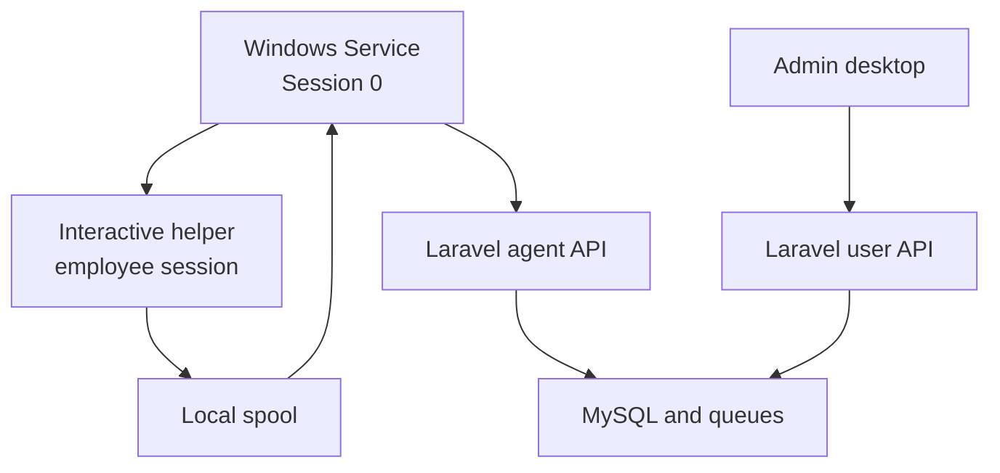

# Windows Desktop Applications — Design Milestone

## 1. Purpose

This document defines the implementation boundary for two Windows deliverables:

1. **Treck Employee Agent** — a silent, automatically started monitoring agent
   installed on employee workstations.
2. **Treck Admin Desktop** — a visible Windows application for authorized
   administrators and managers to inspect live presence, activity, attendance,
   application usage, screenshots, downloads, and reports.

Both applications use the existing Laravel 11 backend as the system of record.
The web dashboard remains supported. This milestone changes no production
runtime behavior; it fixes the architecture and acceptance criteria for the
implementation milestones that follow.

## 2. Decisions

| Area | Decision |
| --- | --- |
| Employee experience | No normal window, taskbar button, timer, or tray menu. The agent runs as a Windows Service and an interactive helper only when desktop access is required. |
| Admin experience | Separate .NET 8 WPF application using MVVM and dependency injection. |
| Backend | Extend the current Laravel API; do not duplicate business rules or store authoritative monitoring data in desktop clients. |
| Authentication | Device tokens for the employee agent; user tokens with role/permission enforcement for the admin application. |
| Local persistence | Existing encrypted device token plus SQLite offline queue for the agent. DPAPI-protected user token and non-sensitive cache for the admin client. |
| Updates | Independently versioned, code-signed installers. Agent updates are controlled by administrators; admin-client updates may prompt the signed-in user. |
| Privacy | No keylogging, clipboard capture, microphone capture, or camera capture. Monitoring must be disclosed through company policy and deployed only where authorized. |
| Compatibility | Windows 10/11 x64; .NET 8; TLS 1.2 or later. |

## 3. Target topology



The Windows Service owns registration, encrypted credentials, upload, retries,
offline storage, service health, and helper supervision. The interactive helper
owns only operations that require the signed-in user's desktop: idle detection,
foreground application observation, screenshots, and download observation.

The admin desktop talks only to user-facing API endpoints. It never reads the
agent database, local spool, provisioning key, or device tokens.

## 4. Employee agent improvements

### 4.1 Preserve the current service/helper model

The current `agent/` implementation already has the correct security boundary:

- `TreckAgent` runs automatically as a Windows Service in Session 0.
- `ScreenshotHelperSupervisor` starts the helper in the active interactive
  session.
- The helper writes events to the local spool.
- The service ingests the spool, stores events durably, and uploads them.

Implementation must extend these components rather than introduce an employee
desktop application with its own authentication or monitoring pipeline.

### 4.2 Silent behavior

Normal operation must:

- show no console window, application window, taskbar button, or notification;
- start automatically at boot and recover after process failure;
- start/restart the helper when the active Windows session changes;
- remain functional when no employee is logged in, without attempting desktop
  capture from Session 0;
- write diagnostics only to `%ProgramData%\TreckAgent\logs`;
- avoid repeated registration prompts or interactive configuration.

Silence is a presentation choice, not concealment. Installation requires local
administrator or managed-deployment authorization, and monitoring must be
documented in the employer's policy.

### 4.3 Configuration and enrollment

Deployment-specific secrets must not be committed to `appsettings.json`.
Installation will accept or provision:

- backend base URL;
- one-time provisioning key or enrollment package;
- optional employee code for dedicated workstations;
- organization-managed feature policy.

After registration, the device token remains DPAPI protected under
`%ProgramData%\TreckAgent`. The provisioning secret is removed from persisted
configuration. Shared computers continue to resolve employees from the Windows
username mapping.

Server-managed configuration is the target source of truth for:

- heartbeat and idle thresholds;
- screenshot enablement, interval, quality, and exclusions;
- application and download exclusions;
- offline retention and upload limits;
- minimum supported agent version.

The local configuration is a bootstrap and last-known-good fallback.

### 4.4 Health and diagnostics

Add a small health state maintained by the service:

- installed agent version;
- service start time;
- last helper heartbeat;
- last event captured;
- last successful API synchronization;
- queued and dead-letter event counts;
- current configuration revision;
- last error category, without sensitive content.

Health is reported through a device-token endpoint and shown only to authorized
administrators. Logs must redact bearer tokens, provisioning values, passwords,
and screenshot/file contents.

### 4.5 Agent acceptance criteria

- Service starts on boot without an interactive login.
- No visible UI is created in normal operation.
- Active/idle classification uses the configured threshold and does not double
  count intervals.
- Lock, unlock, logon, logoff, user switch, sleep, resume, and shutdown are
  handled without creating overlapping work sessions.
- Offline events survive restart and upload in order after connectivity returns.
- A permanently rejected event cannot block newer events.
- Helper restart does not duplicate screenshots or application sessions.
- Tokens and enrollment secrets never appear in logs or source-controlled files.
- Existing monitoring features remain independently disableable by policy.

## 5. Admin desktop application

### 5.1 Project structure

Add a new solution area without coupling it to the agent executable:

```text
admin-desktop/
├── Treck.Admin.Desktop.sln
├── src/
│   ├── Treck.Admin.Desktop/          # WPF views, resources, navigation
│   ├── Treck.Admin.Application/      # View models and use cases
│   ├── Treck.Admin.Api/              # Typed API client and DTOs
│   └── Treck.Admin.Infrastructure/   # DPAPI token store, cache, updater
└── tests/
    ├── Treck.Admin.Application.Tests/
    └── Treck.Admin.Api.Tests/
```

Use `CommunityToolkit.Mvvm`, `Microsoft.Extensions.Hosting`, typed
`HttpClient`, structured logging, and cancellation-aware async operations.
Views do not call HTTP clients directly.

### 5.2 Screens

| Screen | Initial capability |
| --- | --- |
| Sign in | Email/password authentication, validation, safe logout, expired-session handling |
| Overview | Online, active, idle, locked, and offline totals plus today’s active/idle totals |
| Live presence | Searchable employee/computer list, last heartbeat, last activity, today’s active/idle time |
| Employee detail | Daily summary, presence history, application usage, screenshots, and downloads |
| Attendance | Date filters, clock-in/out, worked/active/idle totals, attendance status |
| Screenshots | Authorized thumbnail grid and protected full-size viewing |
| Application usage | Top applications, durations, and session timeline |
| Downloads | Metadata-only list with existing visibility and policy rules |
| Reports | Productivity and attendance filters with server-generated export |
| Agent health | Version, last sync, queue health, configuration revision, and update state |

The first implementation release should prioritize sign-in, overview, live
presence, employee detail, and agent health. Remaining screens follow using the
same API and navigation foundation.

### 5.3 Authorization

The server remains authoritative. Hiding a navigation item is not an
authorization control.

- Super Admin and Admin/HR receive organization-scoped data permitted by their
  existing roles and permissions.
- Managers receive only employees returned by `EmployeeVisibility`.
- Employees cannot sign in to the admin desktop unless explicitly granted an
  administrative or manager permission set.
- Screenshot, download, employee, attendance, and report policies are applied by
  the API for every record and collection.
- The desktop client must treat `401` as an expired/revoked session and `403` as
  insufficient permission; it must not retry either as a transient failure.

### 5.4 Authentication and local security

1. Authenticate through `POST /api/v1/auth/login` with a unique device name.
2. Validate identity and permissions with `GET /api/v1/auth/me` before loading
   the shell.
3. Store the current token with Windows DPAPI for the current user, never in a
   JSON settings file.
4. Revoke the token through `POST /api/v1/auth/logout` on explicit logout.
5. Clear local credentials when the token is rejected or the account is
   deactivated.

Password fields are never logged or cached. The client displays generic login
failure messages and honors backend rate limiting.

### 5.5 Refresh model

The first release uses bounded polling because the existing web application
already supports polling when Reverb is unavailable:

- live presence: every 30 seconds while visible;
- overview: every 60 seconds while visible;
- employee detail: refresh on navigation or user request;
- background/minimized client: suspend live polling.

Only one refresh may run per screen. Navigation and sign-out cancel in-flight
requests. A later release may add Reverb/Echo-compatible push updates after the
polling path is proven.

## 6. Backend API work

Existing user endpoints provide authentication, identity, live activity, and a
single-employee summary. The desktop application needs a stable, versioned read
surface for the other modules.

### 6.1 Reuse immediately

- `POST /api/v1/auth/login`
- `GET /api/v1/auth/me`
- `POST /api/v1/auth/logout`
- `GET /api/v1/activity/live`
- `GET /api/v1/activity/{employee}/summary`

### 6.2 Add for the desktop client

| Method | Endpoint | Purpose |
| --- | --- | --- |
| GET | `/api/v1/desktop/bootstrap` | Current user, roles, permissions, feature flags, server/display timezone |
| GET | `/api/v1/desktop/overview` | Aggregated KPI cards for the caller’s authorized scope |
| GET | `/api/v1/desktop/employees` | Cursor-paginated, visibility-scoped employee directory |
| GET | `/api/v1/desktop/employees/{employee}` | Authorized employee summary/detail |
| GET | `/api/v1/desktop/attendance` | Filtered attendance collection |
| GET | `/api/v1/desktop/app-usage` | Filtered application summaries and sessions |
| GET | `/api/v1/desktop/screenshots` | Screenshot metadata and short-lived signed access URLs |
| GET | `/api/v1/desktop/downloads` | Metadata-only download results |
| GET | `/api/v1/desktop/reports/productivity` | Productivity results using the existing reporting service |
| GET | `/api/v1/desktop/agent-health` | Visibility-scoped agent health and version state |
| POST | `/api/agent/health` | Device-authenticated health update |
| GET | `/api/agent/config` | Device policy and configuration revision |

Desktop controllers must delegate to existing services and policies rather than
reimplement Livewire queries. Collections use cursor pagination, validated
filters, explicit API Resources/DTOs, and query-count tests.

## 7. Packaging and deployment

### Employee agent

- Publish self-contained `win-x64` release output.
- Package as a machine-wide, code-signed MSI.
- Install under `%ProgramFiles%\TreckAgent`.
- Store mutable state only under `%ProgramData%\TreckAgent`.
- Register automatic service startup and recovery actions.
- Support silent install/uninstall parameters for Intune, SCCM, or other MDM.
- Preserve the device identity and queue during in-place upgrades.

### Admin desktop

- Publish self-contained `win-x64` WPF output.
- Package as a per-user or machine-wide signed installer.
- Store user settings/cache under `%LocalAppData%\TreckAdmin`.
- Store tokens only through DPAPI.
- Do not require administrator rights after installation.

Both products display independent semantic versions. The backend advertises the
minimum supported version and update URL; update artifacts must be HTTPS-hosted,
hash-verified, and signed.

## 8. Implementation milestones

1. **Foundation and contracts** — add shared desktop API conventions,
   bootstrap/overview endpoints, API tests, and the admin solution skeleton.
2. **Admin authentication and shell** — sign-in, DPAPI token storage, role-aware
   navigation, error handling, and test doubles.
3. **Live monitoring** — overview, presence list, employee detail, bounded
   polling, and visibility tests.
4. **Agent hardening** — server configuration, health reporting, secret removal,
   helper lifecycle tests, and silent packaging validation.
5. **Monitoring modules** — attendance, screenshots, application usage,
   downloads, reports, and exports.
6. **Release engineering** — signing hooks, installers, upgrade/rollback tests,
   operational documentation, and production readiness review.

Every milestone is committed separately on
`feature/employee-admin-desktop-apps`, with Laravel tests and .NET unit tests run
before the milestone is proposed for review.

## 9. Definition of done

- Both Windows products build from documented commands on a clean Windows build
  host.
- Backend migrations are backward compatible and deploy before client rollout.
- Laravel authorization tests prove organization and manager scoping.
- .NET tests cover authentication, cancellation, token protection, polling,
  offline recovery, and error classification.
- The employee agent operates without visible UI and without secrets in its
  shipped configuration.
- The admin desktop cannot obtain data beyond the signed-in user's permissions.
- Install, upgrade, rollback, service recovery, and uninstall are documented and
  validated.
- Monitoring behavior and data retention are disclosed and configurable.

